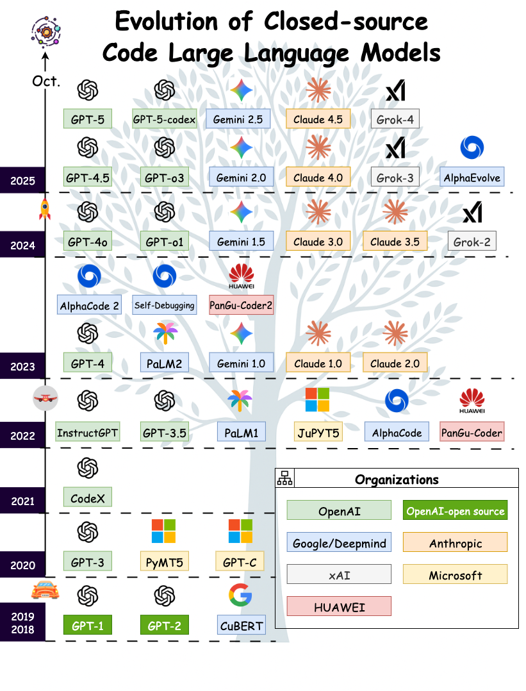
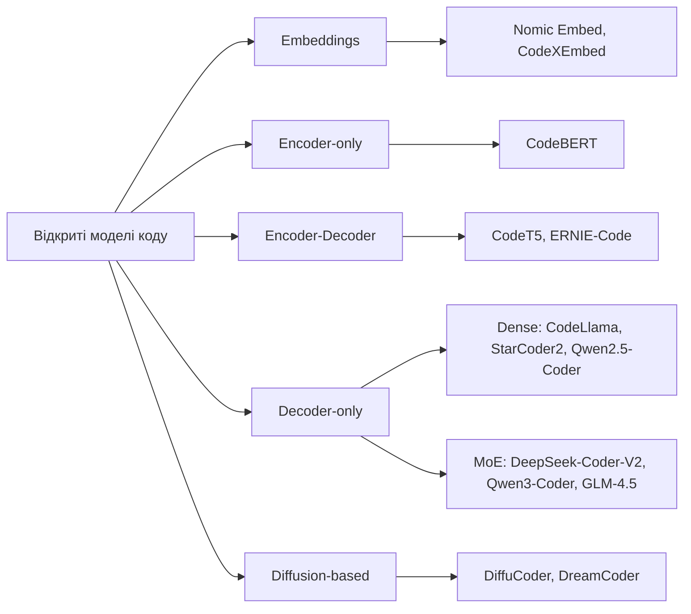
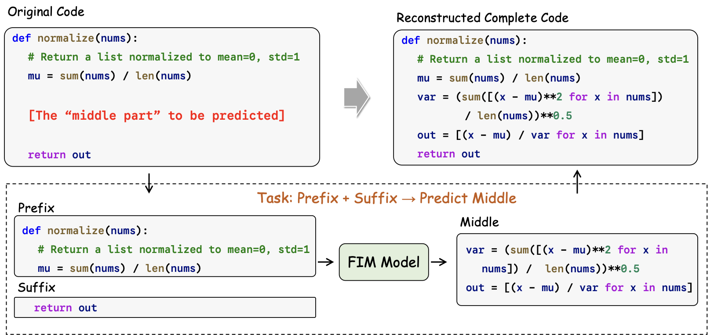
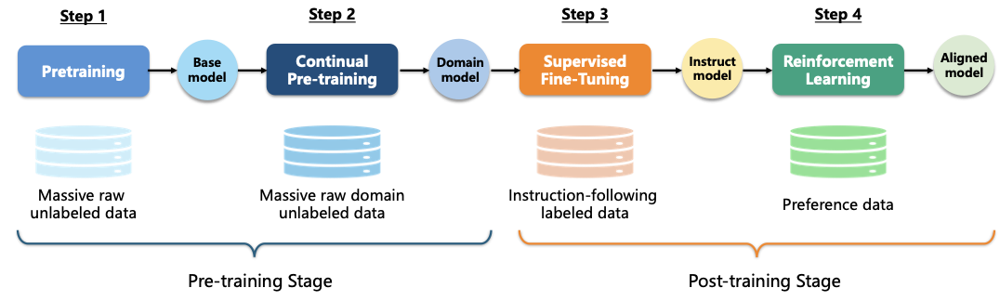

# Частина 2: Базові моделі коду (Code Foundation Models)

## 2.1 Загальні великі мовні моделі (General LLMs)

### Поява загальних LLM
Поява LLM на базі архітектури Transformer стала переломним моментом в ШІ. До цього прогрес був фрагментований між спеціалізованими системами (seq2seq для перекладу, діалогові системи, синтез програм на базі правил). Трансформери дозволили уніфікувати ці напрямки в єдину масштабовану структуру. Закони масштабування (scaling laws) продемонстрували передбачуваний ріст якості зі збільшенням параметрів та обсягу даних.

Загальні LLM виявили дивовижну компетентність у кодуванні. Модель Codex від OpenAI продемонструвала функціональну генерацію коду і ввела бенчмарк HumanEval. AlphaCode від DeepMind досягла рівня професійних програмістів у змаганнях на Codeforces.

*Рисунок 3: Хронологія прогресу мовних моделей коду на бенчмарку HumanEval.*

*Рисунок 4: Хронологія прогресу на SWE-bench-Verified.*

### Архітектури моделей
Еволюція архітектур характеризується переходом від щільних (dense) моделей до розріджених (sparse), таких як Mixture-of-Experts (MoE), які оптимізують баланс між ефективністю та потужністю.

1.  **Щільні моделі (Dense Models):** Базові трансформери (GPT-3, LLaMA 1/2/3, Qwen), де кожен параметр бере участь у кожному обчисленні.
2.  **Суміш експертів (Mixture-of-Experts, MoE):** Токени направляються лише до невеликої підмножини експертів (Mixtral, DeepSeek V2/V3, Qwen-MoE). Це дозволяє мати величезну загальну кількість параметрів при низькій вартості обчислень.
3.  **Рекурентні моделі (Recurrent Models):** Архітектури типу RWKV, RetNet та Mamba, які поєднують паралельне навчання з лінійним часом виводу (inference), що ефективно для довгих контекстів.
4.  **Моделі на основі дифузії (Diffusion-based Models):** Замінюють покрокове декодування ітеративним процесом очищення від шуму (LLADA, Mercury Coder).
5.  **Гібридні архітектури:** Поєднання уваги (attention) трансформерів з рекурентними блоками (Jamba, Qwen3-Next).

### Обмеження загальних LLM
Попри універсальність, загальні LLM мають недоліки в професійному середовищі:
-   **Точність:** Часто створюють код, який виглядає правильним, але не враховує тонкощі API або безпеку.
-   **Безпека:** До 45% генерацій можуть містити відомі вразливості.
-   **Розуміння репозиторіїв:** Важкість у відстеженні залежностей між багатьма файлами навіть при великому вікні контексту.
-   **Агентні обмеження:** Проблеми з довгостроковим плануванням та "галюцинації" інструментів.

---

## 2.2 Моделі коду (Code LLMs)

### Закриті (Closed-source) моделі коду
Закриті моделі перетворилися з простих генераторів на агентні системи, здатні працювати з цілими репозиторіями.

*Рисунок 5: Еволюція закритих моделей (GPT, Gemini, Claude, Grok) з 2018 по 2025 роки.*

-   **Серія GPT (OpenAI):** Від GPT-3 до останньої серії "o" (o1, o3) з акцентом на міркування (reasoning) та GPT-5/GPT-5-Codex, які лідирують на SWE-bench.
-   **Серія PaLM-Gemini (Google):** Еволюція від PaLM 2 до Gemini 1.5/2.5 Pro з нативною мультимодальністю та величезним вікном контексту (1M+ токенів).
-   **Серія Claude (Anthropic):** Від Claude 2 до Claude 4.5, що вирізняється безпекою та потужними агентними можливостями ("computer use").

### Відкриті (Open-source) моделі коду
Відкрита спільнота досягла паритету з багатьма пропрієтарними моделями.

*Таксономія вибраних відкритих моделей коду.*

**Ключові етапи розвитку відкритих моделей:**
1.  **Stage 1: Попередньо навчені енкодери (CodeBERT, CodeT5)** — фокус на розумінні коду та виявленні вразливостей.
2.  **Stage 2: Генеративні моделі (CodeGPT, CodeParrot)** — початок повноцінної генерації коду.
3.  **Stage 3: Великі мовні моделі (StarCoder, Code Llama, DeepSeek-Coder, Qwen2.5-Coder)** — конкуренція з пропрієтарними моделями в інструкціях та розмові.
4.  **Stage 4: Сучасне масштабування та агенти (DeepSeek-Coder-V2, Qwen3-Coder, GLM-4.5)** — використання MoE для масштабування та навчання на траєкторіях вирішення реальних проблем (SWE-bench).

---

## 2.3 Завдання попереднього навчання (Pre-Training Tasks)

1.  **Next Token Prediction (NTP):** Класичне прогнозування наступного токена (CLM), основа більшості моделей.
2.  **Multi-Token Prediction (MTP):** Прогнозування кількох наступних токенів одночасно для покращення ефективності та розуміння структури.
3.  **Fill-in-the-Middle (FIM):** Навчання моделі заповнювати пропуски в коді на основі префікса та суфікса, що критично для IDE (автодоповнення в середині файлу).
4.  **Diffusion Denoising:** Поступове відновлення коду з шуму.

*Рисунок 6: Порівняння цілей навчання: прогнозування одного наступного токена (NTP) та кількох токенів одночасно (MTP).*

*Рисунок 7: Ілюстрація навчання FIM для доповнення коду.*

---

## 2.4 Етапи навчання

Процес навчання розділений на дві основні фази: **Pre-training** (фундаментальні знання на терабайтах коду) та **Post-training** (настроювання на задачі, SFT та RL).

*Рисунок 8: Огляд етапів навчання моделей: від збору сирих даних до фінального узгодження (alignment).*
