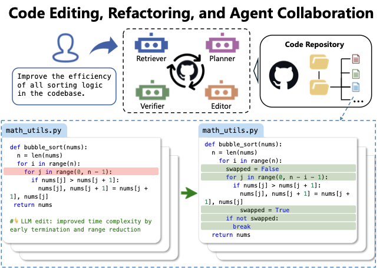
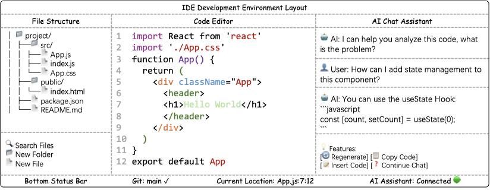

# Частина 3: Завдання, бенчмарки та оцінювання коду

Цей розділ представляє ієрархічну таксономію завдань та бенчмарків для кодування, розділену за трьома основними рівнями деталізації: завдання на рівні функцій/класів, завдання на рівні репозиторіїв та агентні системи.

### Таксономія завдань кодування (узагальнено):
1. **Рівень операторів, функцій та класів:**
   - Доповнення та FIM (CodeXGLUE, HumanEval-Infill, BigCodeBench, ClassEval)
   - Генерація коду (HumanEval, MBPP, EvalPlus, MBXP, HumanEval-XL)
   - Редагування та виправлення помилок (DebugBench, MdEval, HumanEvalPack)
   - Ефективність та уподобання (EffiBench, Mercury, CodeArena)
   - Міркування та QA (CodeQA, CodeMMLU, CRUXEval, SpecEval)
   - Переклад коду та генерація тест-кейсів (MuST, SWT-Bench, TestCase-Eval)

2. **Рівень репозиторію:**
   - Генерація та доповнення (RepoBench, RepoEval, Execrepobench, CrossCodeEval)
   - Специфічні домени та складний код (BioCoder, PaperBench, Commit0)
   - Редагування та колаборація агентів (Aider, RES-Q, LiveRepoReflection)
   - Генерація повідомлень комітів (CommitBench, MCMD)
   - Вирішення завдань ПЗ (SWE-bench Family, JavaBench, SWE-Perf)

3. **Агентні системи:**
   - Використання інструментів (API-Bank, ToolBench, BFCL, Tau Bench)
   - Глибокі дослідження та пошук (GAIA, BrowseComp, xbench)
   - Графічні інтерфейси (GUI) (WebShop, Mind2Web, OmniACT, Design2Code)
   - Використання терміналу (Terminal-Bench)

---

## 3.1 Метрики оцінювання

Еволюція метрик пройшла шлях від простого порівняння рядків до виконання коду та оцінювання за допомогою ШІ.

**Таблиця 2: Ключові метрики оцінювання коду.**

| Метрика | Опис | Формула / Суть |
| :--- | :--- | :--- |
| **Pass@k** | Стандарт для генерації коду. Вимірює ймовірність того, що хоча б один із $k$ зразків пройде тести. | $1 - \frac{\binom{n-c}{k}}{\binom{n}{k}}$ |
| **CodeBLEU** | Розширення BLEU. Враховує не лише текст, а й синтаксичне дерево (AST) та потоки даних. | Синтаксична подібність |
| **LLM-as-a-Judge** | Використання потужнішої моделі (напр. GPT-4) для оцінки якості, читабельності та ефективності коду. | ICE-Score, CodeJudge |
| **RTC** | Round-Trip Correctness. Перевірка консистентності через зворотний переклад (напр. з Python в Java і назад). | Семантична послідовність |

---

## 3.2 Завдання на рівні функцій та класів

### Доповнення коду та FIM (Fill-in-the-Middle)
На відміну від генерації з нуля, ці завдання фокусуються на дописуванні фрагментів у наявному контексті або заповненні "дирок" (FIM), що критично для IDE. Ключові бенчмарки: **HumanEval-Infill**, **SAFIM** (синтаксично-зважений FIM).

### Генерація коду
Найпопулярніші бенчмарки:
- **HumanEval** та **MBPP**: Оцінка генерації на рівні функцій Python.
- **EvalPlus**: Посилені версії HumanEval/MBPP з тисячами додаткових тестів для виявлення прихованих помилок.
- **LiveCodeBench**: Оцінка на свіжих завданнях з LeetCode/Codeforces для уникнення витоку даних.
- **ClassEval**: Спеціальний бенчмарк для оцінки генерації цілих класів із залежностями між методами.

### Виправлення помилок (Bug Fixing)
- **TSSB-3M**: Синтетичні баги на 3 млн прикладів.
- **DebugBench**: 4200+ завдань для складного дебагінгу.
- **HumanEvalPack**: Багатомовний набір для дебагінгу на 6 мовах програмування.

---

## 3.3 Рівень репозиторію

Робота на рівні репозиторію вимагає розуміння залежностей між багатьма файлами.

*Рисунок 9: Ілюстрація завдання генерації та доповнення коду на основі репозиторію.*

- **RepoBench / RepoEval**: Оцінюють здатність моделі витягувати потрібний контекст з інших файлів проекту.
- **SWE-bench**: Найскладніший на сьогодні бенчмарк. Моделі повинні вирішувати реальні тікети (Issues) з GitHub, вносячи зміни в код та проходячи тести.
- **Commit Message Generation**: Автоматичне створення опису змін на основі Diff.

*Рисунок 10: Завдання редагування коду, рефакторингу та колаборації агентів.*

---

## 3.4 Агентні системи

Агенти — це системи, які можуть використовувати інструменти (термінал, браузер, API) для вирішення завдань.

*Рисунок 11: Завдання SNF (Searching Needle Function) у RepoQA: знайти та відтворити функцію з цілого репозиторію за описом.*

- **GUI Агенти**: Робота через інтерфейси (напр. **WebShop**, **Mind2Web**), де ШІ керує мишкою та клавіатурою в браузері.
- **Deep Research**: Автономний пошук інформації та синтез звітів (**GAIA**, **BrowseComp**).
- **Terminal-Bench**: Новий бенчмарк для оцінки роботи в Linux терміналі (конфігурація систем, компіляція ядра тощо).
