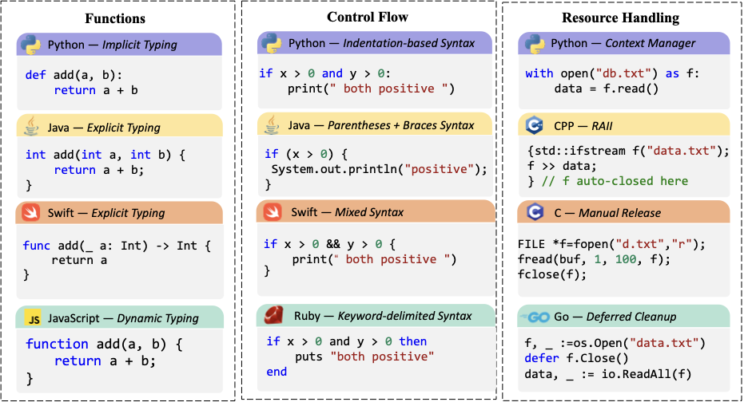
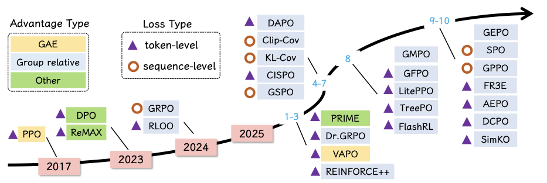

# Частина 4: Узгодження та тонке настроювання (Alignment & SFT)

Узгодження (Alignment) — це процес адаптації попередньо навчених моделей для виконання інструкцій людини. Він складається з двох основних етапів: навчання на демонстраціях (SFT) та навчання з підкріпленням (RL).

## 4.1 Навчання на інструкціях (SFT)

Supervised Fine-Tuning (SFT) навчає модель на наборах даних "запит-відповідь".

### Методи синтезу даних
Якість даних є критичною. Оскільки людських даних (Natural-Instruct) часто не вистачає або вони низької якості, використовують синтетичні методи:

1.  **Self-Instruct:** Модель генерує нові завдання на основі невеликої кількості прикладів.
2.  **Evol-Instruct (WizardCoder):** Ітеративне ускладнення завдань за допомогою евристичних правил (додавання обмежень, ускладнення логіки).
3.  **OSS-Instruct (Magicoder):** Використання фрагментів відкритого коду як основи для генерації завдань.

*Рисунок 12: Три типові методи синтезу даних для узгодження коду.*

### Багатомовна підтримка
Моделі часто демонструють зміщення в бік популярних мов (Python, JS). Справжня багатомовність вимагає розуміння не лише синтаксису, а й глибинної семантики та ідіом кожної мови.

*Рисунок 13: Порівняння синтаксису різних мов програмування для функцій, циклів та роботи з ресурсами.*

---

## 4.2 Навчання з підкріпленням (RL)

RL дозволяє моделям вчитися на власних помилках, використовуючи сигнали винагороди (Reward).

### Алгоритми RL
-   **PPO (Proximal Policy Optimization):** Класичний алгоритм, що використовує модель винагороди та модель-критик.
-   **GRPO (Group Relative Policy Optimization):** Новий ефективний алгоритм (як у DeepSeek-R1), який оцінює групу відповідей відносно одна одної, не потребуючи окремої моделі-критика.
-   **DPO (Direct Preference Optimization):** Простіший метод, що навчається безпосередньо на парах уподобань (краща/гірша відповідь) без моделі винагороди.

*Рисунок 14: Еволюція алгоритмів навчання з підкріпленням для узгодження моделей.*

---

## 4.3 Навчання з верифікованими винагородами (RLVR)

RLVR (Reinforcement Learning with Verifiable Rewards) — це найсучасніший підхід, де винагорода є детермінованою (пройшов тест / не пройшов).

### Ключові особливості RLVR:
1.  **Об'єктивність:** Винагорода надається компілятором або тестами, а не суб'єктивною моделлю.
2.  **Ланцюжок міркувань (CoT):** Моделі вчаться довго думати (reasoning) перед видачею коду, що дозволяє виправляти власні помилки в процесі генерації.
3.  **Ефективність на малих моделях:** За допомогою RLVR моделі розміром 7B-14B можуть досягати результатів, порівнянних з гігантськими пропрієтарними моделями.

**Популярні моделі RLVR:**
-   **DeepSeek-R1:** Проривна модель, що ввела моду на масове використання RL для міркувань.
-   **Open-R1 / Skywork-OR1:** Відкриті спроби відтворити успіх R1.
-   **DeepCoder:** Модель 14B, що демонструє результати на рівні o3-mini.

**Таблиця 3: Набори даних для RL з верифікацією.**

| Назва | К-ть прикладів | Формат перевірки | Джерело |
| :--- | :---: | :--- | :--- |
| **CodeContests** | 13.3k | Ввід/Вивід (I/O) | Codeforces, AtCoder |
| **TACO** | 25.4k | I/O пари | Алгоритмічні змагання |
| **ACECode-87K** | 12.2k | Unit-тести | Синтетика + Stack Python |
| **KodCode** | 48.4k | Pytest / I/O | LeetCode, Codeforces |
