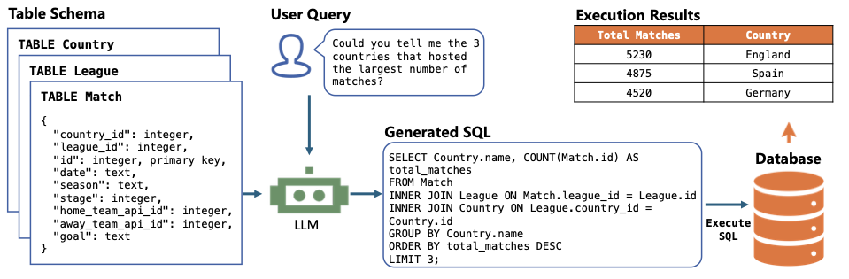
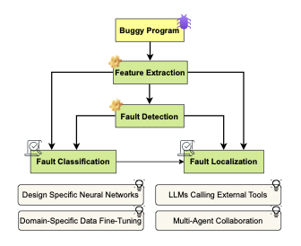
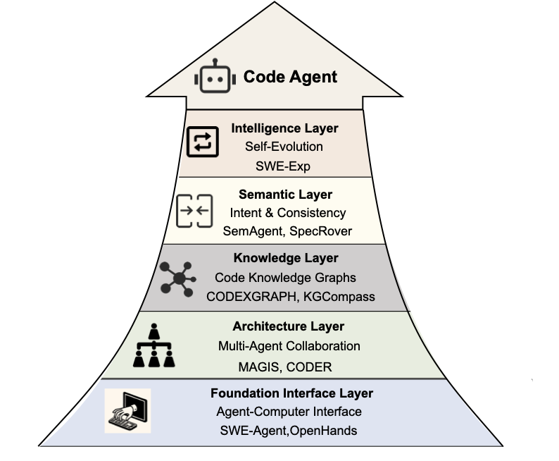

# Частина 5: Агенти програмної інженерії (SWE Agents)

SWE Agents — це автономні або напівавтономні системи, засновані на LLM, які здатні автоматизувати складні робочі процеси розробки ПЗ: від аналізу вимог до розгортання та супроводу.

## 5.1 Життєвий цикл розробки з агентами

Агенти інтегруються на всіх етапах розробки, перетворюючи статичну генерацію коду на динамічний пошук рішень.

### Аналіз вимог
Агенти допомагають збирати вимоги (**Elicitron**), перевіряти їх на суперечливість (**MARE**) та створювати прототипи (**PrototypeFlow**).

### Реалізація та синтез програм
Сучасні агенти працюють за принципом замкненого циклу: "Генерація -> Тестування -> Виправлення".

*Рисунок 15: Огляд процесу синтезу програм агентами.*

-   **Одноагентні системи (Single-Agent):** Одна модель ітеративно покращує свій код (**AlphaCodium**, **Reflexion**).
-   **Мультиагентні системи (Multi-Agent):** Спеціалізовані ролі (Розробник, Тестувальник, Рецензент), що взаємодіють між собою (**ChatDev**, **MetaGPT**).

---

## 5.2 Спеціалізовані агентні завдання

### Text-to-SQL
Трансформація природної мови у складні SQL-запити. Сучасні системи використовують схематичне зв'язування (Schema Linking) та ітеративне виправлення помилок виконання.

*Рисунок 16: Ілюстрація завдання Text-to-SQL.*

### Генерація коментарів та огляд коду (Review)
Агенти не просто дописують текст, а аналізують наміри розробника. Наприклад, **Hydra-Reviewer** аналізує код паралельно за кількома вимірами: логіка, безпека, читабельність.

### Пошук помилок (Fault Localization)
Автоматичне виявлення проблемних рядків коду на основі результатів тестів.

*Рисунок 17: Таксономія методів наскрізної локалізації помилок.*

---

## 5.3 Робота на рівні репозиторіїв (Issue Resolving)

Це найскладніший рівень, де агенти мають розуміти зв'язки між сотнями файлів.

*Рисунок 18: Ієрархічна технічна архітектура агентів: від базового інтерфейсу до інтелектуального рівня.*

-   **SWE-Agent / OpenHands:** Створили спеціальні інтерфейси (ACI), що дозволяють ШІ використовувати термінал та редактор як людина.
-   **Knowledge Layer:** Використання графів знань (**CodexGraph**) для навігації по репозиторію.

*Рисунок 19: Парадигма взаємодії агента з середовищем для вирішення реальних проблем (Issues).*

---

## 5.4 Тестування та супровід

### Автоматичне тестування
Агенти генерують unit-тести (**ChatUniTest**), проводять фаззінг-тестування (**WhiteFox**) та намагаються досягти 100% покриття коду.

*Рисунок 20: Огляд процесу генерації unit-тестів.*

### Супровід (Maintenance)
Сюди входить аналіз логів, оптимізація компіляторів, декомпіляція та деобфускація коду.

*Рисунок 21: Огляд етапів супроводу ПЗ упродовж повного життєвого циклу.*

---

## 5.5 Загальні SWE Агенти (General Agents)
Найвідоміші інструменти, якими вже можна користуватися:
-   **Aider:** Популярний термінальний помічник для парного програмування.
-   **OpenHands:** Потужна open-source платформа для агентів.
-   **Trae / Cursor:** IDE з глибокою інтеграцією агентних можливостей.
-   **Augment:** Корпоративна система з глибоким розумінням контексту великих репозиторіїв.
