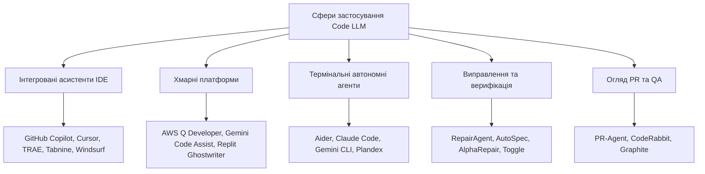

# Частина 6: Застосування Code LLM

Стрімка еволюція Code LLM призвела до зміни парадигми розробки ПЗ: від дослідницьких прототипів до інструментів промислового рівня, інтегрованих у весь життєвий цикл розробки.

*Рисунок 22: Класифікація застосунків на базі великих мовних моделей коду.*

---

## 6.1 Асистенти, інтегровані в IDE

Це найпопулярніша категорія інструментів, що вбудовуються прямо в робоче середовище програміста (VS Code, JetBrains тощо).

-   **GitHub Copilot:** Першопроходець на ринку. Еволюціонував від однієї моделі (Codex) до підтримки багатьох (GPT-4o, Claude 3.5 Sonnet, Gemini 1.5 Pro). Має режими чату та "кодинг-агента".
-   **Cursor:** Форк VS Code, створений спеціально для ШІ. Відомий своїм "Tab model" для миттєвих доповнень та режимом "Composer" для редагування багатьох файлів одночасно.
-   **TRAE:** Нове покоління AI-native IDE з режимами "Builder" та "SOLO", що фокусуються на плануванні та декомпозиції завдань, а не просто доповненні рядків.
-   **Tabnine:** Робить акцент на приватності та безпеці, дозволяючи розгортання on-premises та навчання виключно на дозволеному (permissive) коді.
-   **Windsurf:** Використовує каскадну архітектуру, де кілька спеціалізованих агентів співпрацюють над великими рефакторингами.

---

## 6.2 Хмарні платформи (Cloud-native)

-   **Amazon Q Developer:** Глибоко інтерований з екосистемою AWS, допомагає з написанням інфраструктурного коду (Terraform, CDK) та модернізацією (наприклад, апгрейд Java).
-   **Gemini Code Assist:** Оптимізований для Google Cloud та Kubernetes, підтримує мультимодальні входи (діаграми, скріншоти).
-   **Replit Ghostwriter:** Браузерне середовище, що дозволяє програмувати з будь-якого пристрою без встановлення софту.

---

## 6.3 Термінальні автономні агенти

-   **Aider:** Лідер серед open-source термінальних агентів. Використовує мапи репозиторіїв та інтеграцію з Git для автоматичного створення комітів.
-   **Claude Code:** Новий інструмент від Anthropic, що використовує протокол MCP (Model Context Protocol) для виклику зовнішніх інструментів та пошуку по документації.

---

## 6.4 Виправлення помилок та верифікація

-   **RepairAgent:** Автономно висуває гіпотези щодо багів, локалізує їх та ітеративно виправляє, перевіряючи результати тестами.
-   **AutoSpec:** Автоматично синтезує формальні специфікації (прекондиції, поствимоги) для верифікації коду за допомогою теорем-пруверів.
-   **AlphaRepair:** Поєднує статичний аналіз коду з генеративними можливостями LLM для точного патчингу.

---

## 6.5 Огляд Pull Request (PR) та QA

-   **PR-Agent (Qodo-AI):** Аналізує зміни в коді, генерує резюме PR, знаходить потенційні ризики безпеки та пропонує покращення логіки.
-   **CodeRabbit:** Надає детальні коментарі до кожної зміненої секції, відстежуючи вплив змін на залежності в усьому проекті.
