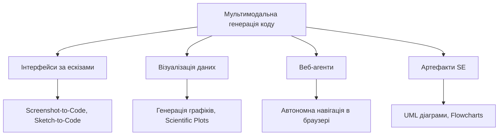

# Частина 8: Спеціалізовані напрямки: Requirements Engineering та Мультимодальність

## 8.1 Агенти для інженерії вимог (Requirements Engineering)

Requirements Engineering (RE) — це міст між побажаннями стейкголдерів та технічною реалізацією. ШІ-агенти тут працюють на чотирьох етапах:

1.  **Збір вимог (Acquisition):** Агенти симулюють користувачів (**Elicitron**), які "користуються" продуктом і дають фідбек про те, чого їм не вистачає.
2.  **Дослідження та узгодження (Examination & Reconciliation):** Мультиагентні дебати (**MAD**), де агенти в ролях Product Owner та QA сперечаються, щоб знайти оптимальні специфікації.
3.  **Моделювання та формалізація:** Перетворення тексту в діаграми або прототипи інтерфейсів (**PrototypeFlow**, **DCGen**).
4.  **Перевірка (Assurance):** Тисячі віртуальних користувачів (**UXAgent**) тестують інтерфейс на зручність (usability).

---

## 8.2 Мультимодальні моделі коду (MCG)

MCG дозволяє моделям розуміти не лише текст, а й зображення, макети та схеми.

*Рисунок 24: Таксономія мультимодальної генерації коду.*

-   **Frontend-генерація:** Перетворення скріншотів або начерків від руки на живий HTML/CSS код. Нові методи (**UICopilot**) використовують ієрархічний підхід: спочатку каркас, потім деталі.
-   **Візуалізація даних:** Агенти (**nvAgent**) перетворюють запити природною мовою на складні графіки та діаграми, аналізуючи дані за допомогою Python.
-   **Веб-агенти:** Системи на кшталт **WebVoyager** використовують "очі" (зір) для навігації по реальних сайтах, натискання кнопок та заповнення форм.
-   **Артефакти SE:** Створення діаграм станів, класів та потоків робіт прямо з опису логіки програми.

---

# Висновок

Цей огляд демонструє шлях розвитку Code LLM: від простих автодоповнювачів до автономних агентів, здатних вирішувати реальні баги в репозиторіях.

Ключові висновки:
1.  **Навчання:** Чистота даних (Data Curation) є важливішою за їх кількість.
2.  **Узгодження:** RLHF та специфічні методи на кшталт LPO дозволяють зробити код безпечнішим без втрати якості.
3.  **Агенти:** Майбутнє за мультиагентними системами, де спеціалізовані моделі взаємодіють у замкненому циклі.
4.  **Безпека:** Моделі за замовчуванням "небезпечні", тому впровадження ізольованих середовищ та систем моніторингу є обов'язковим для промислового використання.

Технологія Code Intelligence стає фундаментом для нової ери розробки ПЗ, де людина виступає у ролі архітектора та рецензента, а ШІ-агенти – у ролі виконавців високого рівня.
