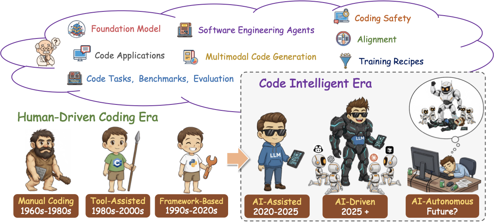

# Частина 1: Вступ

## 1. Вступ

Поява великих мовних моделей (LLM) спричинила парадигмальний зсув в автоматизованій розробці програмного забезпечення, фундаментально переосмисливши відносини між людським наміром та виконуваним кодом.

*Рисунок 1.1: Від ручного кодування ("кам'яна доба") до автономного штучного інтелекту.*

Сучасні LLM досягли вражаючих можливостей у широкому спектрі завдань, пов'язаних з кодом, включаючи доповнення коду, переклад, виправлення та генерацію. Ці LLM ефективно дистилюють роки накопиченої експертизи програмування в доступні інструменти, що слідують інструкціям і можуть бути використані розробниками будь-якого рівня кваліфікації, використовуючи код з таких джерел, як GitHub, Stack Overflow та інші веб-сайти, пов'язані з кодом.

Серед завдань, пов'язаних з LLM, **генерація коду** є однією з найбільш трансформаційних, дозволяючи безпосередньо перекладати описи природною мовою у функціональний вихідний код, тим самим усуваючи традиційні бар'єри між доменними знаннями та технічною реалізацією. Ця можливість вийшла за межі академічної цікавості і стала комерційною реальністю через низку комерційних та відкритих інструментів:

1. **GitHub Copilot** (Microsoft) — надає інтелектуальне доповнення коду в середовищах розробки
2. **Cursor** (Anysphere) — AI-first редактор коду, що дозволяє конверсаційне програмування  
3. **CodeGeeX** (Zhipu AI) — пропонує багатомовну генерацію коду
4. **CodeWhisperer** (Amazon) — безшовно інтегрується з сервісами AWS
5. **Claude Code** (Anthropic) / **Gemini CLI** (Google) — інструменти командного рядка, що дозволяють розробникам делегувати завдання кодування безпосередньо Claude або Gemini з терміналу для агентних робочих процесів кодування

Ці застосунки переформатовують робочі процеси розробки програмного забезпечення, кидають виклик традиційним припущенням про продуктивність програмування та переосмислюють межу між людською креативністю та машинною допомогою.

---

## 1.1 Еволюційна траєкторія генерації коду

*Рисунок 1.2: Огляд еволюції великих мовних моделей коду (Code-LLM) та пов'язаних екосистем з 2021 по 2025 рік. Ландшафт починається з ранніх моделей і швидко розширюється в різноманітний набір LLM-кодерів протягом 2022–2024 років. З 2025 року фокус досліджень зміщується до навчання на основі підкріплення (RL), агентів програмної інженерії (SWE) та нових архітектур, таких як дифузійні моделі коду. Паралельно виникає багата екосистема термінальних інструментів, інтеграцій IDE та плагінів, що підкреслює перехід від чистого моделювання до практичних застосунків, орієнтованих на розробників.*

Еволюційна траєкторія генерації коду розкриває переконливу історію технологічного дозрівання та парадигмальних зсувів. Ранні підходи, обмежені евристичними правилами та ймовірнісними граматичними фреймворками, були за своєю природою крихкими — оптимізованими для вузьких доменів і стійкими до узагальнення в широкому різноманітті програмних контекстів.

Поява **архітектур на основі трансформерів** представляла не просто поступове покращення, а фундаментальне переосмислення проблемного простору, використовуючи механізми уваги та масштаб для захоплення складних відносин між наміром природної мови та структурою коду. Більш того, ці моделі демонструють **емерджентні здатності слідування інструкціям**, які не були явно запрограмовані чи безпосередньо оптимізовані, що свідчить про те, що здатність перекладати високорівневі цілі в виконувані реалізації може бути природним наслідком вивчення багатих представлень у масштабі.

Ця **демократизація кодування**, що дозволяє неекспертам генерувати складні програми через природну мову, несе глибокі наслідки для розвитку робочої сили, темпів інновацій та самої суті обчислювальної грамотності в 21 столітті.

---

## 1.2 Генералісти проти спеціалістів

Сучасний ландшафт Code LLM розкриває стратегічну біфуркацію між генералістськими та спеціалістськими підходами, кожен з яких має різні переваги та компроміси:

### Генералістські моделі
**Представники:** GPT (GPT-4, GPT-5), Claude (Claude 3.7, Claude 4, Claude 4.5), LLaMA (LLaMA 2, LLaMA 3, LLaMA 4)

**Характеристики:**
- Пропонують вражаючу широту, використовуючи величезні корпуси природної мови поряд з кодом
- Розвивають нюансоване розуміння контексту, наміру та доменних знань
- Здатні до міжмодального переносу знань

### Спеціалізовані Code LLM
**Представники:** StarCoder, Code LLaMA, DeepSeek-Coder, CodeGemma, QwenCoder

**Характеристики:**
- Досягають кращої продуктивності на специфічних для коду бенчмарках
- Фокусоване попереднє навчання на даних, орієнтованих на програмування
- Архітектурні оптимізації для конкретних завдань
- Краще розуміння синтаксису та семантики коду

**Драматичні покращення продуктивності** — від одиничних цифр до 95%+ показників успіху на стандартизованих бенчмарках, таких як **HumanEval**, відображають як алгоритмічні інновації, так і глибші інсайти. Хоча код є високо формалізованим, він має спільні основні характеристики з природною мовою, особливо в композиційній семантиці та контекстних залежностях.

---

## 1.3 Прогалини в існуючих дослідженнях

Незважаючи на енергійну дослідницьку діяльність та швидке комерційне впровадження, критична прогалина зберігається між широтою інновацій та глибиною систематичного аналізу в літературі. Існуючі огляди значною мірою приймали панорамні підходи, досліджуючи широкі категорії завдань, пов'язаних з кодом, або фокусуючись на ранніх поколіннях моделей, залишаючи сучасні досягнення неадекватно синтезованими.

### Критично недостатньо досліджені аспекти:

1. **Складні стратегії курації даних** сучасних систем
   - Баланс між кількістю та якістю в інструкційному налаштуванні
   - Методи дедуплікації та фільтрації

2. **Методи узгодження** для вирівнювання поведінки моделі з наміром розробника
   - Включення людського зворотного зв'язку для уточнення виходів
   - Техніки RLHF та Constitutional AI

3. **Передові парадигми промптингу**
   - Chain-of-thought reasoning
   - Few-shot learning
   - In-context learning

4. **Автономні агенти кодування**
   - Здатність до багатокрокової декомпозиції проблем
   - Інтеграція з інструментами розробки

5. **Підходи RAG (Retrieval-Augmented Generation)**
   - Ґрунтування виходів на авторитетних посиланнях
   - Інтеграція з базами знань

6. **Нові фреймворки оцінювання**
   - Виходять за межі простої бінарної коректності
   - Оцінка якості коду, підтримуваності та ефективності

Останні LLM, такі як **Kimi-K2**, **GLM-4.5/4.6**, **Qwen3Coder**, **Kimi-Dev**, **Claude 4.5**, **Deepseek-V3.2-Exp** та **GPT-5**, втілюють ці інновації, проте їхні внески залишаються розкиданими по різних публікаціях без цілісної інтеграції.

---

## 1.4 Порівняння з існуючими оглядами

**Таблиця 1.1: Порівняння між нашим дослідженням та існуючими роботами**

| Огляд | Сфера | Фокус на коді | LLM | Pretrain | SFT | RL | Застосування | Рецепти навчання |
|--------|-------|---------------|-----|----------|-----|----|--------------|--------------------|
| A Survey on Language Models for Code | Всі | ✓ | ✓ | ✓ | ✓ | ✗ | ✓ | ✗ |
| Deep Learning for Code Generation: A Survey | DL, Code Gen, Automated SE | ✓ | ✗ | ✗ | ✗ | ✗ | ✓ | ✓ |
| Code to Think, Think to Code | Code reasoning, planning, debugging | ✓ | ✗ | ✗ | ✗ | ✗ | ✓ | ✗ |
| A Survey on LLMs for Code Generation | Code Generation, Data Process | ✓ | ✓ | ✓ | ✗ | ✗ | ✓ | ✗ |
| A Survey of ML for Big Code and Naturalness | Code patterns, model design | ✗ | ✗ | ✗ | ✗ | ✗ | ✓ | ✗ |
| A Survey on Code Generation with LLM-based Agents | Code Gen, LLM Agents, Multi-agent | ✓ | ✓ | ✓ | ✓ | ✓ | ✓ | ✗ |
| A Survey of Automatic Source Code Summarization | Code Summarization, Program Analysis | ✓ | ✗ | ✗ | ✗ | ✗ | ✓ | ✓ |
| A Review of Automatic Source Code Summarization | Code Summarization, Program Analysis | ✓ | ✗ | ✗ | ✗ | ✗ | ✓ | ✗ |
| Survey on NN-based Automatic Source Code Summarization | Intelligent SE, Code Summarization | ✓ | ✗ | ✗ | ✗ | ✗ | ✓ | ✗ |
| A Survey of Large Language Models | General LLM | ✗ | ✓ | ✓ | ✓ | ✗ | ✓ | ✗ |
| Source code data augmentation for deep learning | Code Data Augmentation | ✓ | ✓ | ✗ | ✓ | ✗ | ✓ | ✗ |
| A Survey of Vibe Coding with LLMs | Vibe Coding | ✗ | ✓ | ✓ | ✓ | ✗ | ✓ | ✗ |
| **Наш огляд** | **Всі** | **✓** | **✓** | **✓** | **✓** | **✓** | **✓** | **✓** |

**Легенда:** ✓ = присутнє/покрито, ✗ = відсутнє/не покрито

Як видно з таблиці, наш огляд є **єдиним**, що охоплює всі ключові аспекти: від попереднього навчання до застосунків, включаючи детальні рецепти навчання та методи reinforcement learning.

---

## 1.5 Внески цього огляду

Щоб надати всебічне та практичне дослідження від фундаментальних моделей коду до агентів та застосунків, ми представляємо детальний посібник, що поєднує теоретичні основи з реалізаціями в сучасних системах генерації коду.

### Наша робота робить кілька ключових внесків:

#### 1. Уніфікована таксономія сучасних Code LLM
Простежуємо їхню еволюцію від ранніх моделей на основі трансформерів до останнього покоління систем з інструкційним налаштуванням та емерджентними здатностями міркування.

#### 2. Систематичний аналіз повного технічного конвеєра

**Стратегії курації та попередньої обробки даних:**
- Методи дедуплікації
- Фільтрація за якістю
- Балансування наборів даних

**Цілі попереднього навчання та архітектурні інновації:**
- Causal language modeling
- Fill-in-the-middle (FIM)
- Masked language modeling

**Передові методології тонкого налаштування:**
- Supervised instruction tuning
- Reinforcement learning from human feedback (RLHF)
- Direct preference optimization (DPO)

#### 3. Дослідження передових парадігм

**Техніки промптингу:**
- Chain-of-thought reasoning
- Few-shot learning
- In-context learning

**Підходи retrieval-augmented generation:**
- Інтеграція з базами знань
- Семантичний пошук коду
- Контекстуальне доповнення

**Автономні агенти кодування:**
- Здатні до складного багатокрокового вирішення проблем
- Інтеграція з інструментами розробки
- Самокорекція та ітеративне покращення

#### 4. Критична оцінка ландшафту бенчмарків

**Сильні сторони існуючих методологій:**
- Стандартизовані метрики (Pass@k, CodeBLEU)
- Різноманітні завдання (генерація, переклад, виправлення)

**Слабкі сторони та виклики:**
- Обмеженість синтетичних завдань
- Недостатня оцінка якості коду
- Проблеми з витоком даних

**Нові напрямки оцінювання:**
- Не лише функціональна коректність
- Якість коду, підтримуваність та ефективність
- Оцінка на рівні репозиторію

#### 5. Синтез інсайтів з проривних моделей

**Аналіз найсучасніших моделей:**
- GPT-5 та GPT-5-Codex
- Claude 4.5
- DeepSeek-V3
- Qwen3-Coder
- Gemini 2.5

**Виявлення трендів:**
- Зсув до агентних систем
- Інтеграція з інструментами розробки
- Покращення довгоконтекстного розуміння
- Мультимодальні можливості

**Відкриті виклики:**
- Безпека генерованого коду
- Масштабування до реальних проектів
- Інтерпретованість та пояснюваність

#### 6. Обширні експерименти

**Всебічне дослідження:**
- Попереднє навчання коду
- Supervised fine-tuning
- Reinforcement learning

**Багатовимірний аналіз:**
- Закони масштабування (scaling laws)
- Порівняння фреймворків
- Чутливість до гіперпараметрів
- Порівняння архітектур
- Аналіз наборів даних

---

## 1.6 Цільова аудиторія

**Цей огляд має на меті служити як:**

### Для дослідників
- **Всебічний довідник** для тих, хто входить у галузь
- Огляд стану мистецтва (state-of-the-art)
- Виявлення прогалин у дослідженнях
- Напрямки для майбутніх досліджень

### Для практиків
- **Стратегічна дорожня карта** для використання технологій у продакшн-середовищах
- Практичні рекомендації з вибору моделей
- Інтеграція з існуючими робочими процесами
- Оцінка trade-offs між різними підходами

### Для освітян
- Структурований матеріал для курсів з AI та програмної інженерії
- Приклади сучасних застосунків
- Еволюція технологій

---

## 1.7 Структура огляду

Решта цього огляду організована наступним чином:

- **Розділ 2: Фундаментальні моделі коду** — Таксономія моделей, архітектури та попереднє навчання
- **Розділ 3: Оцінювання та бенчмарки** — Метрики та методології оцінювання
- **Розділ 4: Узгодження та навчання** — SFT, RLHF та синтез даних
- **Розділ 5: Агенти програмної інженерії** — Автономні системи розробки
- **Розділ 6: Застосування Code LLM** — Реальні інструменти та платформи
- **Розділ 7: Безпека моделей коду** — Ризики та методи захисту
- **Розділ 8: Спеціалізовані напрямки** — Requirements Engineering, мультимодальність
- **Розділ 9: Висновки** — Підсумки та майбутні напрямки

---

**Наступний розділ:** [Частина 2: Фундаментальні моделі коду](./Part_02_Code_Foundation_Models.md)
