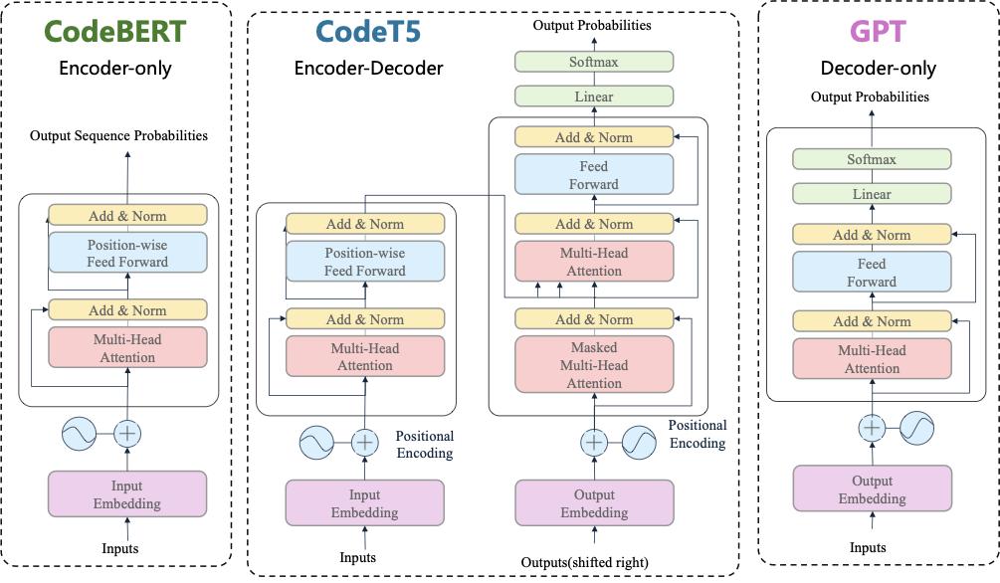
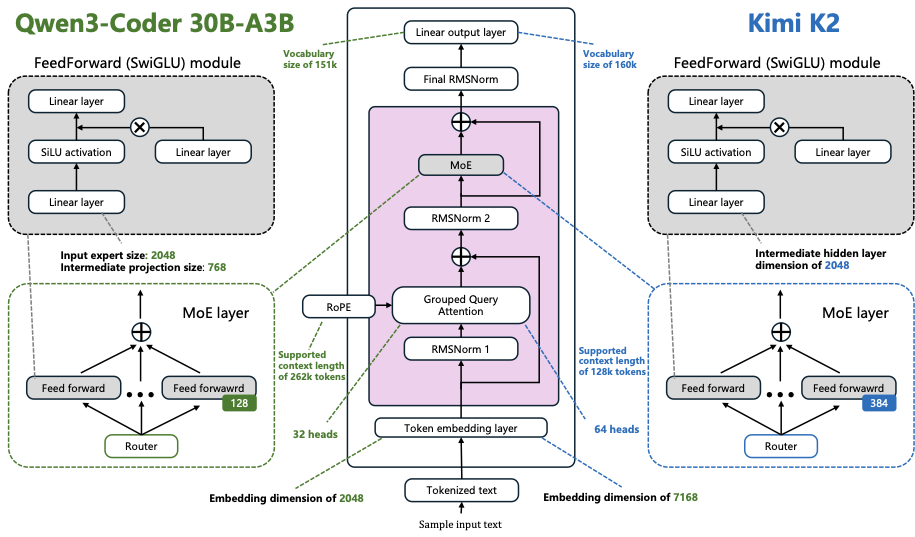
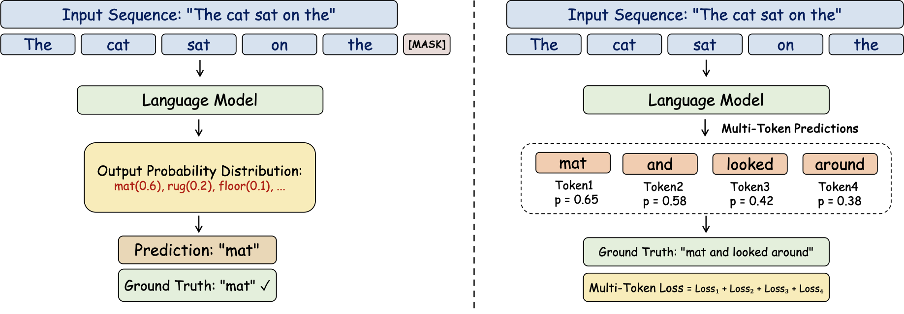
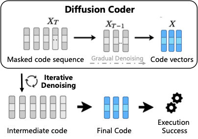

# Частина 2: Фундаментальні моделі коду

## 2. Фундаментальні моделі коду (Code Foundation Models)

### 2.1 Загальні великі мовні моделі (General LLMs)

#### 2.1.1 Поява загальних LLM

Поява LLM, побудованих на архітектурі трансформера, ознаменувала вирішальний зсув у штучному інтелекті. До трансформерів прогрес був фрагментованим між спеціалізованими системами. **Закони масштабування** показують передбачувані покращення з більшою кількістю параметрів моделі, даних та обчислень.

*Рисунок 2.1: Хронологія прогресу мовних моделей коду на бенчмарку HumanEval.*

*Рисунок 2.2: Хронологія прогресу мовних моделей коду на SWE-bench-Verified.*

**Дві ключові здатності:**

1. **Кодування:** OpenAI Codex продемонстрував функціональну генерацію коду з промптів природною мовою. AlphaCode від DeepMind досяг рівня конкурентного програмування приблизно на медіанному людському рівні.

2. **Агентна поведінка:** Методи як ReAct чергують міркування з діями в середовищі. Toolformer показав, що моделі можуть навчитися _коли_ та _як_ викликати API.

---

#### 2.1.2 Архітектури моделей

##### Щільні моделі (Dense Models)

*Рисунок 2.3: Еволюція архітектур від Encoder-only до Decoder-only.*

Модель **трансформер** залишається основою сучасних LLM, де кожен параметр бере участь в обробці кожного токена.

**Ключові моделі:**
- **LLaMA** (7B-70B) — високоякісні відкриті моделі
- **GLM series** — двомовні та багатомовні домени
- **Qwen family** — сильна продуктивність у розумінні та генерації
- **Mistral** — ефективність через групову увагу запитів (GQA)

##### Mixture-of-Experts (MoE)

MoE розширює ємність через умовні обчислення: кожен токен направляється лише до top-k експертів.

**Відкриті моделі:**
- **Mixtral 8×7B** — активація меншої кількості параметрів перевершує більші щільні моделі
- **Qwen MoE** — варіанти у версіях 1.5/2.5/3
- **DeepSeek V2/V3** — 236B/671B параметрів з ~21B/37B активованими
  - V2: Multi-head Latent Attention (MLA)
  - V3: DeepSeek-MoE для ефективного навчання
- **DeepSeek R1** — побудований на V3 з RL для chain-of-thought
- **GLM-4.5** — великомасштабний MoE для кодування та міркування
- **LLaMA-4** — вся серія використовує MoE

##### Рекурентні моделі (Recurrent Models)

Рекурентні архітектури для зменшення пам'яті та затримки:

- **RWKV** — паралельне навчання + рекурентне виведення
- **RetNet** — retention оператор замість уваги
- **Mamba** — селективні state-space моделі
- **Hyena** — довгі згортки з гейтингом
- **DeltaNet / Gated DeltaNet** — апаратно-ефективна паралелізація

##### Дифузійні моделі (Diffusion-based Models)

Ітеративне шумозаглушення замість декодування зліва направо:

- **D3PM** — дискретна дифузія в просторі токенів
- **Diffusion-LM** — безперервний простір вбудовування
- **LLaDA** — навчання з нуля
- **Mercury Coder** — паралельне багатотокенове шумозаглушення для коду
- **Gemini Diffusion** — дослідницька модель від Google

##### Гібридні архітектури

Поєднання різних операторів послідовностей:

- **Jamba** — чергування Transformer + Mamba + MoE
- **Qwen3-Next** — gated DeltaNet + gated attention + MoE
- **DeepSeek V3.2-Exp** — MLA + DeepSeek Sparse Attention (DSA)

---

#### 2.1.3 Мультимодальність

Сучасні LLM для коду повинні обробляти не лише текст, а й візуальну інформацію: діаграми, скриншоти та елементи інтерфейсу користувача (UI). Це необхідно для розуміння того, як код взаємодіє з реальним світом. Можливості обробки аудіо чи мовлення наразі виходять за межі більшості спеціалізованих моделей коду, але нативна мультимодальність (текст/код + зір) стає фундаментом для агентних робочих процесів.

---

#### 2.1.4 Обмеження загальних LLM

**Спеціалізація та точність:**
- Недостатня глибина для професійної програмної інженерії
- Труднощі з підтриманням інваріантів у великих системах

**Безпека та надійність:**
- ~45% генерацій містять відомі вразливості
- Функціонально коректний код може бути небезпечним

**Розуміння на рівні репозиторію:**
- Погіршення продуктивності при інформації в _середині_ контексту
- Труднощі у відстеженні залежностей між файлами

**Агентні обмеження:**
- Крихке довгострокове міркування: помилки при плануванні на довгих горизонтах.
- Галюцинації інструментів: неправильний вибір інструментів, вигадані результати або помилковий час виклику API.

**Мультимодальні перешкоди (Multimodal Friction):**
- Хоча моделі можуть сприймати скриншоти та діаграми, розуміння дрібної ієрархії UI та складної семантики взаємодії залишається слабким місцем.
- Відсутність цілісного розуміння екрана обмежує стабільний перехід від сприйняття (що на екрані) до дії (що потрібно натиснути в коді).

---

### 2.2 Великі мовні моделі коду (Code LLMs)

#### 2.2.1 Закриті (Closed-source) Code LLM

*Рисунок 2.4: Еволюція закритих великих мовних моделей з 2018 по 2025 рік.*

##### Серія GPT (OpenAI)

**Ключові моделі:**
- **GPT-3** — масштабування + in-context learning
- **Codex** — навчання на GitHub, живить Copilot
- **InstructGPT** — RLHF вирівнювання
- **ChatGPT (GPT-3.5)** — багатоходовий діалог
- **GPT-4** — просунуте міркування, мультимодальність (GPT-4o)
- **o-series** (o1, o3) — reasoning-центричне моделювання
- **GPT-5** — провідні результати на SWE-Bench Verified
- **GPT-5-Codex** — агентне кодування через RL

##### Серія PaLM–Gemini (Google)

**Еволюція:**
- **PaLM** — decoder-only з SwiGLU
- **PaLM 2** — багатомовне навчання + UL2 шумозаглушення
- **Gemini 1 & 1.5** — нативна мультимодальність, MoE, мільйонний контекст
- **Gemini 2 & 2.5** — ефективність, міркування, агентні можливості

##### Серія Claude (Anthropic)

**Розвиток:**
- **Claude 1→2** — довгий контекст, безпечне слідування інструкціям
- **Claude 3/3.5** — мультимодальність, виклик функцій
- **Claude 4/4.5** — обмірковуюче міркування, computer-use stack
  - Термінал, редактор, менеджер пакетів, браузер
  - Паралельні обчислення під час тестування

##### Інші

- **Grok (xAI)** — довший контекст, tool use, code-specialized endpoint
- **PanGu-Coder/Coder2** — function-level synthesis, ranking-feedback (RRTF)
- **AlphaCode/AlphaCode 2** — конкурентне програмування, Gemini-based policies

---

#### 2.2.2 Відкриті (Open-source) Code LLM

**Таблиця 2: Відкриті спеціалізовані на коді LLM (вибрані моделі)**

| Модель | Параметри | Контекст | Архітектура | Ключові особливості |
|--------|-----------|----------|-------------|---------------------|
| **StarCoder** | 15B | 8K | MQA | FIM, The Stack |
| **StarCoder2** | 3B/7B/15B | 16K | GQA | The Stack v2, 600+ мов |
| **Code Llama** | 7B/13B/34B | 16K→100K | GQA | Llama2-based, Python-specialized |
| **Qwen2.5-Coder** | 7B/32B | 131K | GQA | 92 мови, YaRN |
| **Qwen3-Coder** | 30B/480B | 262K→1M | GQA+MoE | MoE: 3.3B/35B active |
| **DeepSeek-Coder** | 1.3B-33B | 16K | - | Repository-level, FIM |
| **DeepSeek-Coder V2** | 16B/236B | 128K | MLA+MoE | 2.4B/21B active, 338 мов |
| **Granite Code** | 3B-34B | 8K | GQA | IBM, 116 мов, Apache 2.0 |
| **Codestral** | 22B | 32K | GQA | 80+ мов, FIM |
| **Yi-Coder** | 1.5B/9B | 128K | GQA | 52 мови, компактний |
| **OpenCoder** | 1.5B/8B | 4K/8K | GQA | Повна відкритість, RefineCode |

**Легенда архітектур:**
- **MQA** — Multi-Query Attention
- **GQA** — Grouped Query Attention  
- **MoE** — Mixture of Experts
- **MLA** — Multi-head Latent Attention

---

#### 2.2.3 Еволюція відкритих Code LLM (4 стадії)

**Стадія 1: Encoder моделі**
- **CodeBERT** — RoBERTa-style для розуміння коду
- **GraphCodeBERT** — з графовою структурою
- **ERNIE-Code** — багатомовний encoder-decoder

**Стадія 2: Генеративні моделі**
- **CodeParrot** — GPT-2 для Python
- **CodeGPT** — Microsoft, 110M-1.5B
- **CodeT5/T5+** — T5-derived, identifier-aware

**Стадія 3: Великі мовні моделі**
- **SantaCoder** — BigCode, MQA, FIM
- **StarCoder** — 15B, довгий контекст
- **Code LLaMA** — LLaMA2-based, infilling
- **DeepSeek-Coder** — repository-level pretraining
- **CodeGemma** — Gemma для коду
- **Qwen2.5-Coder** — до 32B, 128K контекст

**Стадія 4: Масштабування та агентні моделі**

*MoE моделі:*
- **DeepSeek-Coder V2** — 236B (21B active)
- **Qwen3-Coder** — 480B (35B active)
- **GLM-4.5/4.6** — hybrid "think" modes
- **Kimi-K2-Instruct** — 10¹² параметрів (3.2×10¹⁰ active)

*Рисунок 2.5: Ілюстрація архітектурних особливостей моделей MoE (Qwen vs Kimi).*

*Агентні моделі:*
- **Skywork-SWE** — execution-aware curation
- **DeepCoder** — RL-trained, repository-level
- **DeepSWE** — RL-only на Qwen3-32B
- **Devstral** — Apache 2.0, Mistral+All Hands AI
- **KAT-Dev** — 62.4% на SWE-Bench Verified

*Передові моделі:*
- **DeepSeek-V3/V3.1/V3.2** — 671B (37B active), DeepThink mode, Sparse Attention
- **MiniMax-M1/M2** — 1M контекст, lightning attention

**Альтернативні архітектури:**
- **DiffuCoder** — masked diffusion, coupled-GRPO

---

#### 2.2.4 Моделі для пошуку коду (Code Retrieval Embeddings)

**Encoder-based:**
- **CodeSage** — 130M-1.3B, 9 мов програмування
- **CodeXEmbed** — 400M/2B/7B, dual-tower

**Decoder-based:**
- **Nomic Embed Code** — 7B, CoRNStack dataset
- **BGE-Code** — Qwen2.5-Coder 1.5B, annealing curriculum
- **CodeFuse-CGE** — cross-attention embedding head

---

### 2.3 Завдання попереднього навчання

*Рисунок 2.6: Порівняння Next Token Prediction (NTP) та Multi-Token Prediction (MTP).*

#### 2.3.1 Next Token Prediction (NTP)

Найбільш фундаментальне завдання самоконтрольованого навчання:
- Передбачення наступного токена на основі контексту
- Causal Language Modeling (CLM)
- Оптимізація: $P(x_{t+1} \mid x_1, x_2, \ldots, x_t)$

#### 2.3.2 Multi-Token Prediction (MTP)

Розширення NTP:
- Передбачення кількох послідовних токенів одночасно
- Покращена ефективність навчання
- Краще захоплення довгострокових залежностей

#### 2.3.3 Fill-in-the-Middle (FIM)

*Рисунок 2.7: Ілюстрація завдання Fill-in-the-Middle для доповнення коду.*

**Принцип роботи:**
- Передбачення пропущеного сегмента між prefix та suffix
- Формат: `<prefix>...<suffix> → <mask>`
- Спеціальні токени: `<fim_prefix>`, `<fim_suffix>`, `<fim_middle>`, `<fim_pad>`

**Режими:**
- **PSM** (Prefix-Suffix-Middle)
- **SPM** (Suffix-Prefix-Middle)

**Використання:** Code LLaMA, CodeGemma, Codestral

#### 2.3.4 Diffusion Coder Training

*Рисунок 2.8: Архітектура Diffusion Coder.*

**Фази:**
1. **Forward diffusion** — додавання шуму до тексту
2. **Reverse denoising** — відновлення тексту з шуму

**Переваги:**
- Вища різноманітність генерації
- Паралельні обчислення

---

### 2.4 Етапи навчання моделей

*Рисунок 2.9: Огляд етапів навчання моделей.*

#### 2.4.1 Pre-training (Попереднє навчання)

**Компоненти:**

1. **Збір та обробка даних**
   - Веб-текст, книги, академічна література
   - Очищення, дедуплікація
   - Токенізація, стандартизація формату

2. **PT (Pre-training Stage)**
   - Навчання з випадкової ініціалізації
   - Autoregressive або masked language modeling
   - Вивчення граматики, семантики, світових знань

3. **CPT (Continual Pre-training)**
   - Додаткове навчання на доменних даних
   - Адаптація до вертикальних доменів
   - Оновлення знань

4. **Annealing Strategy**
   - Динамічне налаштування learning rate
   - Великий LR на початку → поступове зменшення
   - Запобігання проблемам конвергенції

#### 2.4.2 Post-training (Після навчання)

1. **Supervised Fine-Tuning (SFT)**
   - Анотовані пари "вхід-вихід"
   - Адаптація до специфічних завдань
   - Мінімізація помилки передбачення

2. **Reinforcement Learning (RL)**
   - Оптимізація через винагороду
   - RLHF (Reinforcement Learning from Human Feedback)
   - Навчання Reward Model → оптимізація через RL

**Таблиця 3: Фази навчання різних Code LLM**

| Модель | PT | CPT | ANN | Repo PT | SFT | RL | Repo SFT |
|--------|----|----|-----|---------|-----|----|----------|
| SantaCoder | ✓ | | | | ✓ | | |
| StarCoder | ✓ | | | | ✓ | | |
| Code Llama | | ✓ | | | ✓ | | |
| DeepSeek-Coder | ✓ | | | ✓ | ✓ | | |
| Qwen2.5-Coder | | ✓ | | ✓ | ✓ | | |
| DeepSeek-V3 | | ✓ | | | ✓ | ✓ | |
| Qwen3-Coder | - | ✓ | ✓ | ✓ | ✓ | ✓ | ✓ |

**Легенда:**
- **PT** — Pre-training
- **CPT** — Continued pre-training
- **ANN** — Annealing training
- **Repo PT** — Repository-level pre-training
- **SFT** — Supervised fine-tuning
- **RL** — Reinforcement learning
- **Repo SFT** — Repository-level SFT

---

### 2.5 Відкриті набори даних для попереднього навчання

**Таблиця 4: Відкриті набори даних для попереднього навчання коду**

| Набір даних | Розмір | Мови | Джерело | Ключові особливості |
|-------------|--------|------|---------|---------------------|
| **The Stack v1** | 2.9 TB | 358 | GitHub | Permissive licenses, 2-stage dedup |
| **The Stack v2** | 32.1 TB | 600+ | Software Heritage, GitHub | 4× більше v1, opt-out process |
| **OpenCoder** | 3.3 TB | 13 | GitHub, cc, FineWeb | Повна відкритість |
| **StarCoderData** | 783 GB | 86 | The Stack v1.2 | Decontamination, issues+commits |
| **The Pile** | 825 GB | 30+ | GitHub, Stack Exchange | EleutherAI, GPT-Neo foundation |
| **RedPajama** | 120 GB | 50+ | GitHub | MIT/BSD/Apache 2.0 only |
| **CodeParrot** | 50 GB | 1 (Python) | GitHub | Python-only, 70% removed via dedup |

#### 2.5.1 The Stack Dataset Family

**The Stack v1:**
- 3.1 TB permissively licensed коду
- 358 мов програмування
- Двоетапна дедуплікація (exact-match + MinHash LSH)
- Виключно з GitHub з дозволеними ліцензіями

**The Stack v2:**
- 900 мільярдів токенів (~32 TB)
- 600+ мов
- Software Heritage archive + GitHub PRs/issues + Jupyter notebooks
- Формальний opt-out процес

#### 2.5.2 StarCoderData

- Похідний від The Stack v1.2
- 783 GB, 86 мов
- Додаткове очищення та decontamination
- Контекстуальні дані з GitHub issues та commits

#### 2.5.3 Інші важливі набори

**The Pile:**
- 825 GB від EleutherAI
- Основа для GPT-Neo та Pythia
- Перший великомасштабний відкритий відтворюваний набір

**RedPajama:**
- Реплікація даних LLaMA
- 59 мільярдів токенів коду
- Лише високо дозвільні ліцензії (MIT, BSD, Apache 2.0)

**CodeParrot:**
- Фокус виключно на Python
- ~70% даних видалено через дедуплікацію
- Демонструє важливість очищення

---

### 2.6 Майбутні тренди

#### 2.6.1 Від загального до спеціалізованого інтелекту коду

Траєкторія від загальних LLM до спеціалізованих кодерів:
- GPT-3 показав емерджентні можливості коду
- GPT-5-Codex, Claude-4 демонструють переваги доменної оптимізації
- Майбутнє: чітке розділення між розмовним AI та coding assistants

**Очікування:**
- Кращі результати на repository-level завданнях
- Складні сценарії відлагодження
- Багатокрокові процеси програмної інженерії

#### 2.6.2 Агентне навчання та майстерність у складних сценаріях

Парадигмальний зсув від пасивної генерації до активної інженерії:

**Методології навчання:**
- Reinforcement learning з execution feedback
- Curriculum learning на прогресивно складних завданнях
- Інтеграція з зовнішніми інструментами

**Можливості:**
- Розуміння контексту проекту
- Навігація по кодовим базам
- Ітеративні цикли відлагодження
- Співпраця з розробниками

**Приклад:** SWE-Bench агенти як автономні software engineers

#### 2.6.3 Закони масштабування та наукова розробка моделей

Систематичні та ефективні стратегії навчання:

**Принципи:**
- Розуміння масштабування продуктивності з параметрами, даними, обчисленнями
- Оптимальний розподіл ресурсів
- Mixture-of-experts для ефективності

**Результат:**
- Більш здатні системи
- Економічно ефективні моделі
- Data-driven оптимізація

---

## Висновки розділу

Фундаментальні моделі коду еволюціонували від простих encoder-only систем до складних агентних архітектур з мільярдами параметрів. Ключові досягнення:

1. **Архітектурна різноманітність:** Dense, MoE, Recurrent, Diffusion, Hybrid
2. **Масштабування:** Від 100M до 671B параметрів (DeepSeek-V3)
3. **Спеціалізація:** Від загальних LLM до Code-specific моделей
4. **Агентність:** Від генерації коду до автономної програмної інженерії
5. **Відкритість:** Потужні відкриті моделі конкурують з закритими

**Майбутнє:** Спеціалізовані, агентні системи з науково обґрунтованими стратегіями масштабування.

---

**Наступний розділ:** [Частина 3: Оцінювання та бенчмарки](./Part_03_Evaluation.md)
