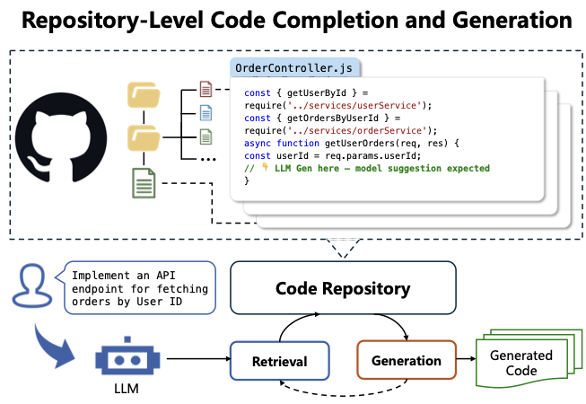
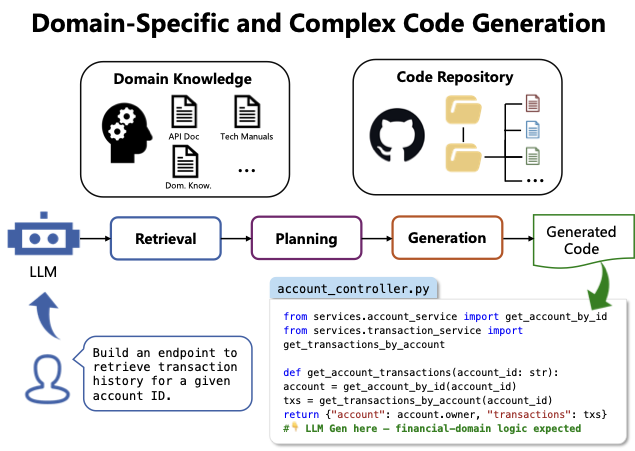

# Частина 3: Завдання коду, бенчмарки та оцінювання

## 3. Завдання коду, бенчмарки та оцінювання

Цей розділ представляє ієрархічну таксономію завдань кодування та бенчмарків, організованих за трьома основними гранулярностями: (i) завдання на рівні statement/function/class; (ii) завдання на рівні репозиторію; (iii) агентні системи.

---

### 3.1 Метрики оцінювання

#### 3.1.1 Розширення традиційних метрик

**CodeBLEU**
- Розширення BLEU для коду
- Включає: n-gram matching, AST matching, data flow matching
- **Обмеження:** не оцінює функціональну коректність

**CodeBERTScore**
- Метрика на основі pre-trained моделей
- Обчислює семантичну подібність через вбудовування
- Формула: $P=\frac{1}{|\hat y|}\sum_j\max_i\text{sim}(y^*_i,\hat y_j)$

**Pass@k**
- **Найпопулярніша метрика** для Code LLM
- Вимірює ймовірність, що хоча б одне з k рішень проходить тести
- **Biased Pass@k:** $1 - \frac{\binom{n-c}{k}}{\binom{n}{k}}$
- **Unbiased Pass@k:** $1 - (\frac{n-c}{n})^k$
- Де: n = загальна кількість генерацій, c = коректні генерації, k = кількість вибірок

**Round-Trip Correctness (RTC)**
- Несуперв'язоване оцінювання через двонаправлені завдання
- Перевіряє семантичну консистентність (наприклад, code translation туди-назад)

---

#### 3.1.2 Парадигма LLM-as-a-Judge

**ICE-Score**
- Перший фреймворк, що використовує LLM для оцінки якості коду
- Структуровані критерії оцінювання (usefulness, correctness)
- Оцінка: $S \in \{0,1,2,3,4\}$

**CodeJudge**
- Побудований на ICE-Score з механізмом "slow-thinking"
- Виводить бінарне рішення або deviation score (0-1)

**CodeJudgeBench**
- LLM безпосередньо оцінює функціональну коректність без виконання
- Формула: $J \leftarrow \text{LLM}(p \oplus r \oplus q)$

**BigCodeReward**
- Перший бенчмарк для reward models у кодуванні
- Включає execution feedback (logs, screenshots, plots)
- Вихід: $J \in \{\text{A}, \text{B}, \text{Tie}\}$

> **Важливе зауваження:** Головною перевагою парадигми LLM-as-a-Judge є здатність аналізувати глибоку семантику, але основним обмеженням є **нестабільність результатів**, що часто зумовлена схильністю моделей до генерації надмірно розлогих пояснень замість чіткої оцінки.

---

#### 3.1.3 Метрики на основі виконання

**ProbeGen**
- Генерує цільові тест-кейси для перевірки еквівалентності коду
- Якщо $p_k(f_i) \neq p_k(f_j)$, то $f_i \not\equiv f_j$

**REFUTE**
- Оцінює здатність LLM знаходити контрприклади
- Формула: $H(x^*) \cap \neg P(x^*)$

**EvaLooop**
- Self-contained feedback-loop оцінювання
- Метрика ASL (Average Sustainable Loops): $ASL=\frac{\sum_{i=1}^M n_i\,i^2}{M\cdot N}$

---

#### 3.1.4 Інші парадигми

**MCTS-Judge**
- Test-time computation через Monte Carlo Tree Search
- Багатоперспективне міркування (boundary conditions, exception handling)

**Incoherence**
- Вимірює невизначеність LLM у генерації коду
- Вища incoherence = більша стохастичність

**Mean Absolute Deviation (MAD)**
- Оцінює робастність evaluators до поверхневих змін
- Менша MAD = вища консистентність

**Copilot Arena & BigCodeArena**
- Платформи для збору user preference votes
- Використовують Bradley-Terry model для ранжування

---

### 3.2 Завдання на рівні Statement/Function/Class

#### 3.2.1 Code Completion та Fill-in-the-Middle

**Таблиця 3.1: Бенчмарки Code Completion та FIM**

| Бенчмарк | Рік | Гранулярність | Мови | Розмір | Оцінювання |
|----------|-----|---------------|------|--------|------------|
| **Code Completion** |
| CodeXGLUE | 2021 | Statement | 3+ | 104K | Exact Match |
| HumanEval-Infill | 2022 | Function | Python | 164 | Unit Tests |
| ExecRepoBench | 2024 | Statement | Python | 1.2K | Tests+Accuracy |
| BigCodeBench | 2024 | Function | 3+ | 1.1K | Functional Tests |
| MultiPL-E | 2022 | Function | 3+ | 12.7K | Diversity |
| ClassEval | 2024 | Class | Python | 100/412 | Unit Tests |
| ClassEval-T | 2024 | Class | Java, C++ | 94 | Unit Tests |
| OOP | 2024 | Class | Python | 431 | OOP Patterns |
| **Fill-in-the-Middle** |
| CCCI | 2025 | Statement | Java | 289 | Contextual Quality |
| SAFIM | 2024 | Syntax-aware | 3+ | 17.7K | Syntax Correctness |
| AST-FIM | 2025 | AST-based | 12 | 30K+ | Structural Accuracy |

**Ключові інсайти:**
- **Statement-level:** CodeXGLUE (exact match), HumanEval-Infill (unit tests)
- **Function-level:** BigCodeBench (реальні репозиторії), MultiPL-E (різноманітність рішень)
- **Class-level:** ClassEval показує значне падіння продуктивності порівняно з function-level
- **FIM:** SAFIM (syntax-aware), AST-FIM (структурна точність)

*Рисунок 3.1: Огляд завдань генерації та доповнення коду.*

---

#### 3.2.2 Code Generation

**Таблиця 3.2: Бенчмарки генерації коду (вибрані)**

| Категорія | Бенчмарк | Рік | Розмір | Мови | Домен | Складність |
|-----------|----------|-----|--------|------|-------|------------|
| **Function-Level** |
| | HumanEval | 2021 | 164 | Python | Algorithmic | ⭐⭐ |
| | MBPP | 2021 | 974 | Python | Intro Coding | ⭐⭐ |
| | HumanEval+ | 2023 | 164 | Python | Algorithmic | ⭐⭐⭐ |
| | MBPP+ | 2023 | 378 | Python | Algorithmic | ⭐⭐⭐ |
| | HumanEval Pro | 2024 | 164 | Python | Algorithmic | ⭐⭐⭐⭐ |
| | BigCodeBench | 2024 | 1.1K | Python | General | ⭐⭐⭐⭐⭐ |
| | HumanEval-XL | 2024 | 22K | Multi-PLs+NLs | Cross-lingual | ⭐⭐⭐⭐⭐ |
| | McEval | 2025 | 12K | Python | Mathematical | ⭐⭐⭐⭐⭐ |
| **Class-Level** |
| | ClassEval | 2024 | 100 | Python | OOP | ⭐⭐⭐ |
| | ClassEval-T | 2024 | 94 | Python, Java, C++ | OOP | ⭐⭐⭐⭐ |
| | OOP | 2024 | 431 | Python | OOP | ⭐⭐⭐ |
| **Competition** |
| | APPS | 2021 | 10K+ | Python | Algorithmic | ⭐⭐⭐⭐ |
| | LiveCodeBench | 2024 | 121 | Multi-PLs | Dynamic | ⭐⭐⭐⭐ |
| | CodeElo | 2025 | 387 | C++, Python | Algorithmic | ⭐⭐⭐⭐ |
| | ICPC-Eval | 2025 | 118 | C++ | Algorithmic | ⭐⭐⭐⭐ |
| **Domain-Specific** |
| | SciCode | 2024 | 338 | Python | Scientific | ⭐⭐⭐ |
| | FullStackBench | 2024 | 3K | Multi-PLs | Web | ⭐⭐⭐⭐ |
| | Deep-Bench | 2025 | 520 | Python | Deep Learning | ⭐⭐⭐ |
| | KernelBench | 2025 | 250 | Python | GPU kernel | ⭐⭐⭐⭐ |
| | TritonBench | 2025 | 184 | Triton | GPU kernel | ⭐⭐⭐⭐ |

**Еволюція бенчмарків:**
1. **Ранні:** HumanEval, MBPP (базові функції)
2. **Розширені тести:** HumanEval+, MBPP+ (більше тест-кейсів)
3. **Складніші:** HumanEval Pro, BigCodeBench (реальні сценарії)
4. **Мультимовні:** HumanEval-XL (23 NL × 12 PL)
5. **Доменно-специфічні:** SciCode, Deep-Bench, KernelBench

*Рисунок 3.2: Розподіл бенчмарків генерації коду за спеціалізованими доменами.*

---

#### 3.2.3 Code Edit та Bug Fix

**Таблиця 3.3: Бенчмарки редагування та виправлення помилок**

| Категорія | Бенчмарк | Рік | Мова | Розмір | Джерело | Ключова особливість |
|-----------|----------|-----|------|--------|---------|---------------------|
| **Statement-Level** |
| | Megadiff | 2021 | Java | 663K | VCS Commits | Real-world changes |
| | TSSB-3M | 2022 | Python | 3M | Synthetic | Mutation-based |
| | RunBugRun | 2023 | Multi-PLs | 450K | GitHub | Executable pairs |
| | DebugBench | 2024 | C++/Java/Python | 4.2K | Curated | Controlled debugging |
| | MdEval | 2024 | Multi-PLs | 3.5K | Instruction | 18 languages |
| **Interactive \u0026 Feedback** |
| | SWT-Bench | 2024 | Python | 1.9K | GitHub | Test-driven repair |
| | FeedbackEval | 2025 | Python | 394 | Synthetic | Iterative refinement |
| | DebugEval | 2024 | Python | 4253 | Curated | Self-debugging |
| | CodeEditorBench | 2024 | Multi-PLs | 1216 | IDE simulation | Incremental editing |

**Тренди:**
- **Від commit logs до executable pairs:** RunBugRun (450K виконуваних пар)
- **Мультимовність:** xCodeEval (4.7M, 10+ мов)
- **Інтерактивність:** SWT-Bench (test-driven), FeedbackEval (iterative)
- **IDE-подібні сценарії:** CodeEditorBench (incremental editing)

*Рисунок 3.3: Огляд завдань редагування та модифікації коду.*

---

#### 3.2.4 Code Efficiency

**Performance та Complexity:**
- **EffiBench:** 1K задач, GPT-4 до 3× повільніше, 14-44× більше пам'яті
- **Mercury:** Багатовимірний фреймворк (час, пам'ять, складність)
- **BigO(Bench):** Оцінка асимптотичної складності
- **DynaCode:** Input scaling для виявлення неефективності

**Energy Consumption:**
- **ECCO:** Code-level трансформації для ефективності
- **EffiCoder:** Fine-tuning з runtime та memory signals
- **ACECode:** RL для оптимізації коректності + ефективності

---

#### 3.2.5 Code Preference

**Holistic Scoring:**
- **CodeArena:** Динамічний score (correctness × difficulty + efficiency)
- **Long CodeArena:** Project-level розуміння

**Human Alignment:**
- **CodePrefBench:** Вирівнювання з людськими перевагами
- **AutoCodeArena:** LLM-as-a-judge з Bradley-Terry моделлю
- **BigCodeArena:** User preference votes у реальних середовищах

---

#### 3.2.6 Code Reasoning та QA

**Question-Answer Pairs:**
- **CodeQA:** 100K+ пар з коментарів коду
- **CS1QA:** Пари з чат-логів курсу Python
- **CodeMMLU:** Різноманітні завдання (repair, execution, fill-in-blank)

**Deep Semantic Reasoning:**
- **SpecEval:** Формальні специфікації програм
- **CRUXEval:** Output prediction + Input prediction
- **EquiBench:** Program equivalence checking
- **CORE:** Static analysis (data/control dependency)
- **ScratchEval:** Оцінка мультимодальних моделей за допомогою візуальної блочної мови програмування Scratch.

---

#### 3.2.7 Code Translation

**Еволюція підходів:**

1. **Foundational (Syntax to Sequence):**
   - Tree-to-tree Neural Networks (AST трансформації)
   - TransCoder (unsupervised pre-training)

2. **Execution \u0026 Feedback:**
   - Test-and-repair paradigm
   - Compiler feedback + RL
   - Dynamic analysis для semantic errors

3. **Prompt Engineering:**
   - "Explain-then-Translate"
   - Intermediate languages + planning
   - Multi-agent collaboration

4. **Safety-Critical:**
   - C/C++ → Rust (memory safety)
   - Differential fuzzing
   - Static analysis guidance

5. **Data Augmentation:**
   - MuST (aligned snippets)
   - BabelTower (back-translation)
   - FedCoder (federated learning)

---

#### 3.2.8 Test-Case Generation

**Таблиця 3.4: Бенчмарки генерації тест-кейсів**

| Категорія | Бенчмарк | Рік | Джерело | Мова | Проблем | SPP* |
|-----------|----------|-----|---------|------|---------|------|
| **Software Engineering** |
| | SWT-Bench | 2024 | SWE-Bench | Python | 1900+ | 1 |
| | TestGenEval | 2024 | SWE-Bench | Python | 1210 | 1 |
| | TestBench | 2024 | Github | Java | 108 | 1 |
| | CLOVER | 2025 | Github | Python | 845 | 1 |

*Рисунок 3.4: Приклад завдання генерації повідомлень комітів на основі змін у коді.*

*SPP = Solutions Per Problem

---

### 3.3 Завдання на рівні репозиторію

#### 3.3.1 Repository-Level Generation

**Ключові бенчмарки:**
- **RepoEval:** Cross-file code completion
- **RepoBench:** Multi-file context understanding
- **CrossCodeEval:** Cross-file dependency tracking

**Виклики:**
- Довгий контекст (тисячі рядків)
- Міжфайлові залежності
- Глобальне міркування

---

#### 3.3.2 Software Engineering Tasks

**SWE-Bench Family:**
- **SWE-Bench:** 2,294 GitHub issues з реальних репозиторіїв.
- **SWE-Bench Verified:** 500 вручну перевірених задач (Docker-based).
- **SWE-Bench Lite:** 300 найрепрезентативніших задач для економії обчислень.
- **SWE-Bench Multilingual:** Розширення на 9 мов програмування (C++, Java, JS тощо).
- **SWE-bench Multimodal (M):** 517-619 задач на основі зображень (скриншоти багів у GUI).

**Інші SWE бенчмарки:**
- **JavaBench:** Оцінювання об'єктно-орієнтованого міркування в Java.
- **SWE-Lancer:** Фреймворк, що оцінює **економічну цінність** рішень на основі реальних завдань з UpWork (~$1M загальної вартості).
- **GitBench:** Робота з Git-процесами та вирішення конфліктів злиття.
- **DevBench:** Повний цикл розробки програмного забезпечення.
- **RepoQA:** Питання-відповіді на рівні цілого репозиторію.

*Рисунок 3.5: Ілюстрація роботи RepoQA в сучасних AI-редакторах.*

---

### 3.4 Агентні системи

#### 3.4.1 Tool Use

**Бенчмарки:**
- **ToolBench:** API calling та tool selection
- **APIBench:** RESTful API interaction
- **ToolAlpaca:** Instruction-following з інструментами

#### 3.4.2 Web \u0026 GUI Interaction

**Бенчмарки:**
- **WebArena:** Realistic web tasks
- **Mind2Web:** Web navigation
- **VisualWebArena:** GUI interaction

#### 3.4.3 Terminal Use

**Бенчмарки:**
- **BashEval:** Shell command generation
- **TerminalBench:** CLI interaction
- **OSWorld:** OS-level tasks

---

## Висновки розділу

### Ключові тренди в оцінюванні:

1. **Від синтаксису до семантики:**
   - CodeBLEU → Pass@k → LLM-as-a-Judge
   - Фокус на функціональній коректності

2. **Від простих до складних завдань:**
   - HumanEval (164) → BigCodeBench (1.1K) → SWE-Bench (2.3K)
   - Function-level → Repository-level → Agentic

3. **Від статичних до динамічних:**
   - Фіксовані тести → Execution feedback → Interactive repair
   - LiveCodeBench (temporal alignment)

4. **Від одновимірних до багатовимірних:**
   - Correctness → Correctness + Efficiency + Security + Readability
   - Holistic evaluation (CodeArena, BigCodeArena)

5. **Від синтетичних до реальних:**
   - Synthetic problems → Real GitHub issues (SWE-Bench)
   - Educational tasks → Production code

### Відкриті виклики:

- **Contamination:** Витік даних у тренувальні набори
- **Evaluation cost:** Pass@k потребує багато генерацій
- **Human alignment:** LLM-as-a-Judge не завжди узгоджується з людьми
- **Long-context:** Обмеження в repository-level оцінюванні
- **Multimodality:** Оцінка GUI та візуальних елементів

---

**Наступний розділ:** [Частина 4: Узгодження та навчання](./Part_04_Alignment.md)
