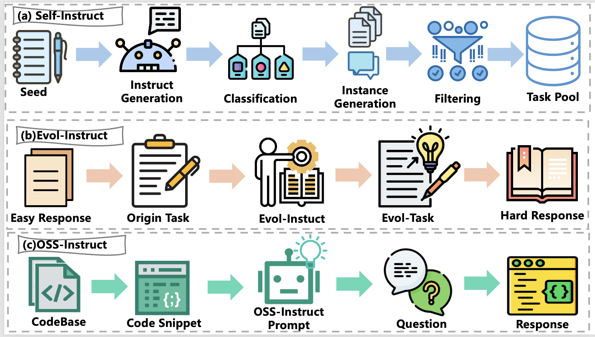

# Частина 4: Узгодження (Alignment)

Узгодження в Code LLM — це процес адаптації попередньо навчених моделей для виконання інструкцій людини та ефективного вирішення завдань програмування. Цей розділ охоплює SFT (Supervised Fine-tuning) та RL (Reinforcement Learning), включаючи навчання з верифікованими винагородами (RLVR) та мультимодальні аспекти.

---

## 4.1 Supervised Fine-tuning (SFT)

SFT навчає модель на анотованих наборах даних "інструкція-відповідь". Це перетворює загальну модель на спеціалізованого асистента.

### 4.1.1 Синтез даних для SFT
Оскільки якість людських даних (Natural-Instruct) часто неоднорідна, популярними стали методи **Self-Instruct** (генерація даних самою моделлю).

*Рисунок 4.1: Три типові методи синтезу даних для узгодження коду (Self-Instruct, Evol-Instruct, OSS-Instruct).*

*   **Складність (Complexity):** Метод *Evol-Instruct* використовує правила для ітеративного ускладнення простих завдань.
*   **Різноманітність (Diversity):** *OSS-Instruct* (Magicoder) використовує фрагменти коду з відкритих джерел як основу для генерації нових завдань.
*   **Чутливість (Sensitivity):** *CTF-Instruct* додає контрфактуальні приклади, щоб навчити модель бути уважною до нюансів промпту.

### 4.1.2 Багатокомпонентне SFT
*   **Зворотний зв'язок (Execution Feedback):** Використання компіляторів для перевірки згенерованого коду. Якщо код помилковий, модель отримує повідомлення про помилку та виправляє його.
*   **Мультиагентні системи:** *AutoCoder* використовує агентів (питальник та програміст) для ітеративного вдосконалення коду через діалог.

### 4.1.3 SFT для завдань рівня репозиторію
Сучасні моделі мають розуміти структуру всього проекту:
*   **SWE-набори даних:** *SWE-smith*, *SWE-Synth* та *SWE-Gym* надають тисячі реальних баг-репортів з GitHub для навчання агентів виправленню помилок.
*   **Кібербезпека (Cybersecurity):** Набори даних у стилі CTF (Capture The Flag), такі як *Cyber-Zero* та *CTF-Dojo*, навчають моделі виявляти та експлуатувати вразливості, використовуючи Docker-контейнери для безпечного виконання.

### 4.1.4 Методи на основі міркування (Reasoning)
Сучасні моделі (як-от DeepSeek-R1) переходять від простого виконання інструкцій до явного **ланцюжка думок (Chain-of-Thought, CoT)**:
- **Парадигма міркування:** CoT дозволяє моделі розбивати складні задачі на проміжні кроки, що критично для репозиторних завдань.
- **Rejection Sampling Fine-Tuning (RFT):** Метод, де модель генерує кілька варіантів рішення, які фільтруються тестами. Навчання відбувається лише на правильних траєкторіях, що підвищує якість даних та різноманітність міркувань.
- **Структура над фактами:** Дослідження показують, що навчання структурованому підходу до розв'язання задач навіть на недосконалих логічних ланцюжках є кориснішим, ніж просте заучування правильних відповідей.

---

## 4.2 Reinforcement Learning (RL)

RL використовує сигнали винагороди для подальшого вдосконалення моделі.

### 4.2.1 Алгоритми RL
*   **PPO (Proximal Policy Optimization):** Стандартний алгоритм, що використовує модель-критик для стабілізації навчання.
*   **GRPO (Group Relative Policy Optimization):** Проривний алгоритм (використаний у DeepSeek), який відмовляється від моделі-критика на користь групового оцінювання. Це суттєво зменшує витрати пам'яті та робить навчання стабільнішим для довгих ланцюжків міркувань.
*   **DPO (Direct Preference Optimization):** Пряма оптимізація на парах переваг (краща/гірша відповідь) без окремої reward-моделі.
*   **RLHF vs RLAIF:** Навчання на основі людських переваг проти навчання на основі фідбеку від потужніших моделей (AI Feedback).

*Рисунок 4.2: Еволюція алгоритмів RL від PPO до сучасних GRPO та DPO-варіантів.*

### 4.2.2 Напрямки застосування RL у коді
1.  **Генерація коду:** Оптимізація функціональної коректності (проходження тестів).
2.  **Розуміння коду:** Покращення якості пояснень коду та документування.
3.  **Безпека коду:** Навчання моделі уникати небезпечних паттернів програмування.

---

## 4.3 RL з верифікованими винагородами (RLVR)

Це найбільш потужний варіант RL для коду, де модель отримує детермінований сигнал (pass/fail) від тестів або компіляторів.

*   **Користь:** RLVR дозволяє моделям самостійно досліджувати простір рішень, отримуючи миттєве підтвердження коректності від компілятора чи тестів.

**Таблиця: Набори даних для навчання RLVR (вибрані)**

| Датасет | Завдання | К-ть прикладів | Формат тесту |
|---------|----------|----------------|--------------|
| **CodeContests** | Алгоритми | 13.3K | IO pairs |
| **TACO** | Алгоритми | 25.4K | IO pairs |
| **AceCode-87K** | Debug/Синтез | 87K | Unit tests |
| **SYNTHETIC-2** | SWE/Reasoning | 61K+ | IO pairs |
| **KodCode** | Спеціалізовані | 48.4K | Pytest/IO |

**Представницькі моделі, навчені за допомогою RLVR:**
1. **DeepSeek-R1 / Open-R1**: Використовують GRPO для досягнення SOTA результатів.
2. **Skywork-OR1**: Досягає ~63% на LiveCodeBench за допомогою масштабування RL.
3. **DeepCoder-14B**: Компактна модель, що завдяки RLVR наздоганяє гігантів (як o3-mini) у написанні коду.

---

## 4.4 Мультимовне та мультимодальне розуміння коду

### 4.4.1 Мультимовний код (Multilingual)
Сучасні моделі підтримують 100+ мов програмування. Ключовим є ефект крос-мовного переносу (cross-lingual transfer): знання Python допомагають моделі краще розуміти логіку в менш поширених мовах. Проте мови відрізняються не лише синтаксисом, а й філософією керування пам'яттю та обробки помилок.

*Рисунок 4.3: Порівняння синтаксису "Функцій", "Керування потоком" та "Роботи з ресурсами" між мовами Python, Java, Rust та C++.*

### 4.4.2 Мультимодальний код (Multimodal)
Інтеграція візуальної інформації в робочі процеси програмування:
1.  **Frontend-генерація:** Перетворення макетів дизайну (Figma/скриншоти) безпосередньо в HTML/CSS/React код.
2.  **Візуалізація даних:** Генерація коду для складних графіків на основі аналізу зображень таблиць або описів.
3.  **Web-Embodied Intelligence:** Агенти, що керують браузером, аналізуючи візуальний стан сторінки для виконання дій.
4.  **Артефакти ПЗ:** Розуміння діаграм архітектури (UML) та блок-схем для автоматичної побудови скелета системи.

---

**Наступний розділ:** [Частина 5: Агенти програмної інженерії](./Part_05_SWE_Agents.md)
