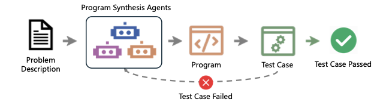
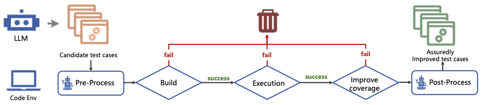
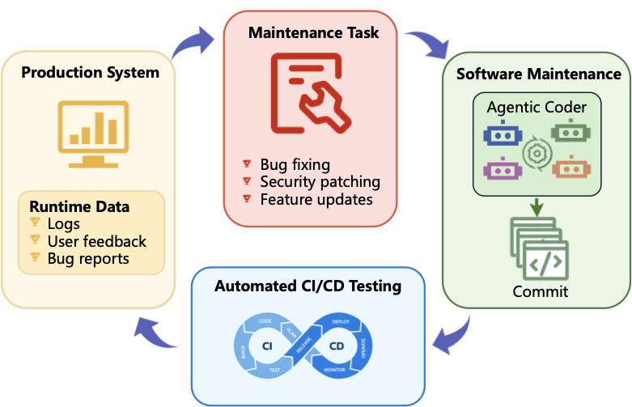
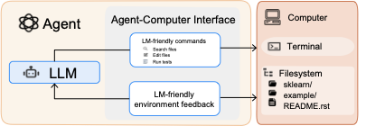
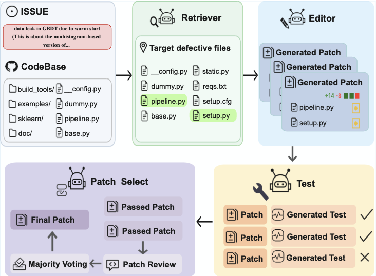

# Частина 5: Агенти програмної інженерії (SWE Agents)

Останні розробки в галузі великих мовних моделей сприяли появі **SWE Agents** — автономних або напівавтономних систем, призначених для підтримки, автоматизації або покращення традиційних робочих процесів програмної інженерії.

*Рисунок 5.1: П'ятирівнева архітектура вирішення завдань (issue resolving) для SWE-агентів.*

Цей розділ організовано за фазами класичної каскадної моделі розробки ПЗ (waterfall model).

---

## 5.1 Інженерія вимог (Requirements Engineering)

Агенти допомагають на всіх етапах роботи з вимогами користувача:
*   **Збір вимог (Acquisition):** *Elicitron* симулює діалог із користувачем для виявлення прихованих потреб та генерації реалістичних сценаріїв.
*   **Аналіз вимог (Examination):** *MARE* та *MAD* використовують дебати між кількома агентами для виявлення конфліктів та двозначностей у вимогах.
*   **Моделювання вимог (Modeling):** *Progressive Prompting* та *PrototypeFlow* трансформують текстові описи у формальні специфікації та перші прототипи інтерфейсів.
*   **Забезпечення якості (Assurance):** *SimUser* симулює поведінку конкретних персон (користувачів) для перевірки того, чи відповідають вимоги реальним потребам.

---

## 5.2 Фаза розробки (Software Development)

**Архітектури агентів синтезу програм:**

*Рисунок 5.2: Огляд процесу синтезу програм: від специфікації до верифікації.*

*   **Одноагентні ітеративні системи:** (*AlphaCodium*, *Self-Refine*) Один агент самостійно покращує свій код через цикли саморефлексії та зворотного зв'язку від тестів.
*   **Мультиагентні конвеєри (Pipelines):** (*ChatDev*, *MetaGPT*, *AgentCoder*) Розподіл ролей (програміст, тестувальник, менеджер). Це дозволяє проводити глибший аналіз, але створює ризики "комунікаційного шуму".

**Стратегії пошуку рішень:**
1. **Паралельне семплювання (Best-of-N):** Генерація багатьох варіантів та вибір найкращого.
2. **Гібридний пошук ($S^*$):** Поєднання різноманітності (breadth) через семплювання та глибини (depth) через ітеративне виправлення.

**Text-to-SQL:** Понад 20 спеціалізованих систем (як-от *CHESS*, *XiYan-SQL*) фокусуються на перетворенні природної мови у складні запити до баз даних. Ключовими технологіями тут є *Schema Linking* (зв'язування з назвами таблиць) та *Execution Feedback* для виправлення синтаксису.

*Рисунок 5.3: Процес перетворення тексту в SQL-запит із врахуванням схеми БД.*

### 5.2.2 Аналіз, рев'ю та документація
*   **Генерація документації:** *RepoAgent* автоматично підтримує та оновлює документацію в міру еволюції коду. *METAMON* використовує метаморфне тестування для перевірки відповідності документації реальній поведінці коду.
*   **Code Review:** Агенти автоматизують перевірку pull requests.

**Таблиця: Представницькі системи агентного рев'ю**

| Система | Архітектура | Ключова інновація |
|---------|-------------|-------------------|
| **Hydra-Reviewer** | Паралельний аналіз | Розподіл за вимірами (логіка, безпека, стиль) |
| **CodeAgent** | Симуляція команди | Запобігання "дрейфу промптів" через QA-контроль |
| **DeputyDev** | Оркестрація експертів | Гібридний рушій для злиття результатів |
| **iCode-Reviewer** | Динамічний мікс | Роутинг до вузьких фахівців за типом вразливості |

### 5.2.3 Локалізація помилок та авто-виправлення (APR)
*   **Fault Localization:** Агенти допомагають знайти точне місце виникнення багу, аналізуючи трейси та дерево викликів.

*Рисунок 5.4: Класифікація методів наскрізної локалізації помилок.*

*   **Patch Generation:** Автономні системи (*RepairAgent*, *AutoCodeRover*) не лише знаходять баги, але й пропонують готові виправлення, які проходять існуючі тести.

---

## 5.3 Тестування ПЗ (Software Testing)

### 5.3.1 Генерація модульних тестів (Unit Testing)
Агенти на кшталт *ChatUniTest* та *TestPilot* створюють тестові набори, орієнтовані на максимальне покриття коду (coverage).

*Рисунок 5.5: Огляд процесу генерації модульних тестів за допомогою LLM.*

### 5.3.2 Фаззінг-тестування (Fuzz Testing)
На відміну від модульних тестів, фаззінг шукає вразливості, генеруючи неочікувані або "зламані" вхідні дані:
*   **AutoSafeCoder:** Мультиагентна система, що поєднує статичний аналіз та динамічний фаззінг для виявлення дірок у безпеці.
*   **Mut4All:** Синтезує оператори мутації коду для перевірки надійності компіляторів.

### 5.3.3 Інші види тестування
*   **Репродукція багів:** *AEGIS* автоматично відтворює збої ПЗ на основі баг-репортів.
*   **Інтерактивне тестування функцій:** *MAdroid* симулює дії користувачів у графічних інтерфейсах (Android) для перевірки складних сценаріїв взаємодії.
*   **Автономне виконання:** *ExecutionAgent* самостійно будує середовище виконання (Docker, залежності) для запуску тестів у складних проектах.

---

## 5.4 Супровід та оптимізація (Maintenance)

*Рисунок 5.6: Огляд завдань супроводу програмного забезпечення.*

*   **Аналіз логів:** Агенти аналізують гігабайти системних логів. Одноагентні системи (*R-Log*) фокусуються на міркуванні перед висновком, мультиагентні (*LogRESP-Agent*, *Audit-LLM*) використовують дебати між агентами для перевірки гіпотез.
*   **Оптимізація компіляторів:** *CompilerDream* та інші системи вивчають оптимальні стратегії трансформацій для покращення швидкості виконання.
*   **Декомпіляція та Деобфускація:** Відновлення коду з бінарних файлів (*LLM4Decompile*) та повернення змістовних назв змінним (*VarBERT*, *Androidmeda*).
*   **DevOps та CI/CD:** *AutoDev* та *GPT-Engineer* автономно керують циклами збирання та розгортання ПЗ.

---

## 5.5 Вирішення завдань рівня репозиторію (Issue Resolving)

Це вершина розвитку SWE-агентів, де система має обробити GitHub issue в реальному середовищі. Технічна архітектура таких систем складається з п'яти рівнів:

1.  **Foundational Layer (Інтерфейс):** (*SWE-Agent*, *OpenHands*) Створення спеціальних агент-комп'ютерних інтерфейсів (ACI), які спрощують команди терміналу для LLM.
2.  **Architectural Layer (Модульність):** Розподіл на ролі (планувальник, навігатор, редактор). *AGENTLESS* доводить, що спрощення (без-агентний підхід) також може бути ефективним.
3.  **Knowledge Layer (Знання):** Використання графів знань репозиторію (*CodexGraph*, *KGCompass*) для розуміння складних залежностей між файлами.
4.  **Semantic Layer (Семантика):** Глибоке розуміння намірів розробника та логіки програми (*SemAgent*, *SpecRover*).
5.  **Intelligent Layer (Самонавчання):** (*SWE-Exp*, *SE-Agent*) Здатність агента вчитися на минулих помилках та успішних виправленнях, накопичуючи власний досвід.

*Рисунок 5.7: Парадигма взаємодії "агент-середовище" через спеціалізовані інтерфейси.*

*Рисунок 5.8: Типовий робочий процес (workflow) для вирішення завдань рівня репозиторію.*

---

**Наступний розділ:** [Частина 6: Агенти загального призначення](./Part_06_Generalist_Agents.md)
