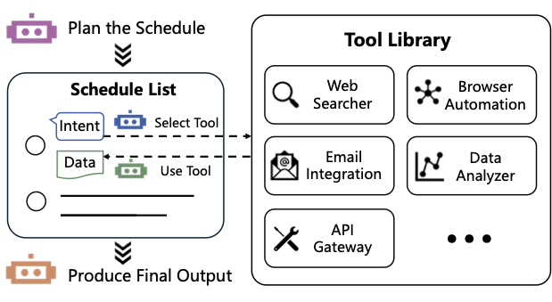

# Частина 6: Код для агентів загального призначення

Використання коду як універсального середовища дозволяє ШІ-агентам не лише міркувати над проблемами, але й виконувати дії у різноманітних завданнях та середовищах, виходячи за межі вузькоспеціалізованих функцій.

---

## 6.1 Таксономія коду для агентів загального призначення

Інтеграція коду стала ключовою парадигмою в розробці агентів, поєднуючи когнітивні міркування з виконуваними діями. Основні виміри архітектури агентів включають:

1.  **Протоколи взаємодії (Interaction Protocols):** Структуровані фреймворки зв'язку, включаючи шаблони використання інструментів (*ReAct*, *ReWOO*, *DERA*), протокол контексту моделі (MCP) та схеми координації кількох агентів (A2A).
2.  **Агентні можливості (Agentic Capabilities):** Підходи, що дозволяють агентам генерувати та виконувати код для складної логіки (*CodeAct*, *Smolagents*, *Open Interpreter*), маніпулювання даними та планування (*CodePlan*), що підвищує їхню автономність.
3.  **Інтерфейси середовища (Environment Interfaces):** Код як основа симульованих середовищ (*PuzzleGYM*, *SpatialGYM*, *GameArena*) та інтерфейсів реального світу (GUI та термінальні агенти).

---

## 6.2 Код як протоколи взаємодії

### 6.2.1 Використання інструментів (Tool Use)
У робочих процесах агентів кожен інструмент втілений у коді, який визначає як синтаксичний інтерфейс, так і семантичну логіку.

*Рисунок 6.1: Робочий процес використання інструментів: від запиту користувача до виконання коду та отримання результату.*

*   **Виклик функцій (Function Calling):** Центральний механізм взаємодії. ШІ витягує параметри з вводу користувача та надсилає запит серверу інструмента. Ключові виклики: точна екстракція форматів, повнота параметрів та валідація значень.
*   **Підходи без донавчання (Tuning-Free):** Використовують навчання в контексті (few-shot). Приклади: *Reverse Chain* (ідентифікує цільовий інструмент, а потім заповнює параметри), *EasyTool* (ChatGPT переписує довгі описи інструментів у лаконічні інструкції).
*   **Підходи з донавчанням (Tuning-Based):** 
    *   *GPT4Tools:* Використовує LoRA для навчання відкритих моделей на датасетах, згенерованих ChatGPT.
    *   *ToolkenGPT:* Вводить спеціальні токени ("toolkens"), які спрацьовують як тригери для перемикання моделі в режим генерації параметрів.
    *   *Themis:* Покращує інтерпретованість через авторегресійну інтеграцію міркувань та виклику інструментів.
*   **Агентні фреймворки:** 
    *   *ReWOO:* Двоетапна структура — планування (список викликів) та виконання (Worker-агенти).
    *   *DERA:* Протокол "Виконати → Пауза → Діалог → Продовжити" для уточнення неоднозначних інструкцій.

---

## 6.3 Код як агентні можливості

### 6.3.1 "Мислення" кодом (Thinking in Code)
Генерація коду значно підвищує точність складних міркувань, особливо в математиці та алгоритмічних задачах.
*   **PAL (Program-aided Language models) & PoT (Program of Thoughts):** Заміна текстового ланцюжка думок (CoT) на програмний Python-код для обчислень.
*   **Удосконалення міркувань:** *MathPrompter* (математичні шаблони), *CSV* (самоверифікація через зворотне міркування).
*   **Chain of Code (CoC):** Розширення на загальні семантичні завдання. Псевдокод (цикли, умовні конструкції) структурує логіку, навіть якщо окремі кроки потребують природної мови.
*   **Планування:** *CodePlan* використовує генерацію коду дляCapture implicit planning trajectories. *PGPO* інтегрує псевдокод у ReAct-цикли, замінюючи текстові плани виконуваними кроками.

### 6.3.2 "Дія" кодом (Acting in Code)
*   **CodeAct:** Парадигма, де агенти взаємодіють із середовищем через Python. Перевага: результати зберігаються у змінних і використовуються в наступних кроках без зайвих дій.
*   **ToC (Tree of Code):** Створення ієрархічного дерева коду з самостійним зворотним зв'язком та голосуванням більшістю для вибору найкращого рішення.
*   **Ефект "Інверсної шкали" (Inverse Scaling):** Дослідження (*Chen et al.*) виявили цікавий тренд: менш потужні моделі (GPT-3.5) частіше покладаються на Python-інтерпретатор і досягають вищої точності, тоді як потужні моделі (GPT-4o) часто виявляють "надмірну впевненість" у своїх текстових міркуваннях, що призводить до помилок.
*   **Рішення для надійності:** Паралельне виконання (текст + код), вибір на основі впевненості (confidence) та примусове використання коду.

### 6.3.3 Спеціалізовані застосування
*   **EHRAgent:** Дозволяє медикам аналізувати електронні медичні карти через генерацію коду для складних запитів до баз даних.
*   **Taskweaver:** Орієнтований на складну обробку даних, де кожен плагін сприймається як функція Python.

---

## 6.4 Код як інтерфейси середовища

### 6.4.1 Code as Simulation Gym (CodeGYM)
Створення складних середовищ для навчання агентів довгостроковому плануванню на базі *Gymnasium*:
*   **Dynamic PuzzleGYM:** Генерація логічних пазлів (*LogicGame*, *KORBench*, *ZebraLogic*). Такі середовища мають нульовий рівень витоку (data leakage), оскільки задачі генеруються динамічно.
*   **Synthetic SpatialGYM:** Створення 3D та просторових завдань (*RLBench*, *Meta-World*) за допомогою інструментів візуалізації (*Manim*, *Matplotlib*).
*   **GameArena:** Оцінка стратегічного мислення в іграх. Від класичних (*StarCraft II*, *Minecraft*) до соціально-дедуктивних (*Avalon*, *Werewolf*).

### 6.4.2 Агенти для використання комп'ютера (Computer-Use Agents)

1.  **GUI-агенти (графічні інтерфейси):**

*Рисунок 6.2: Розвиток агентів для веб-інтерфейсів: від текстових (AWST) до мультимодальних (WebVoyager, WebEvolver).*

    *   **Сприйняття (Perception):** 
        *   *Текстове:* Використання HTML або Accessibility trees. *MindAct* використовує поетапну фільтрацію елементів.
        *   *Візуальне:* *OmniParser* парсить скриншоти в структуровані карти елементів, що критично, коли доступ до коду сторінки обмежений.
        *   *Мультимодальне:* *WebVoyager* накладає мітки (Set-of-Marks) прямо на скриншот для кращого орієнтування моделі.
    *   **Взаємодія (Interaction):** Симуляція дій людини (*pyautogui*) або прямий виклик API. Гібридні підходи (*ComputerRL*) автоматично синтезують API-коди для прискорення роботи.

2.  **Термінальні агенти:**
    *   *OB-1:* Використовує спільну пам'ять та механізм таймаутів, розрізняючи швидкі команди та тривалі процеси (наприклад, компіляція ядра).
    *   *Wrap:* Веде динамічний список справ (to-do list) і має механізм повторних спроб (fallback) у разі помилок сервера чи лімітів.

3.  **Крос-платформенні агенти:**
    *   *Manus:* Виконує код у пісочниці VM і генерує HTML-відповіді.
    *   *OpenAI Deep Research:* Глибокий пошук та інтерпретація веб-контенту для створення звітів.
    *   *OpenManus:* Мультиагентна система з розподілом ролей та рефлексією над помилками.

---

**Наступний розділ:** [Частина 7: Безпека моделей коду](./Part_07_Safety.md)
