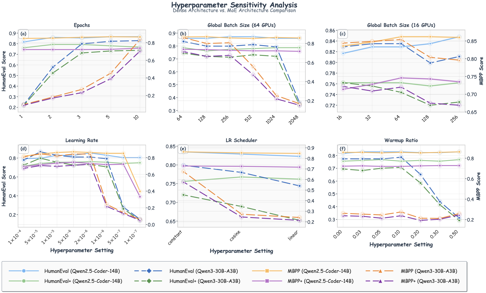
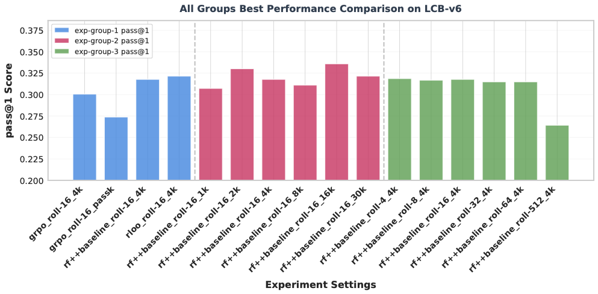

# Частина 8: Рецепти навчання Code LLM

Навчання сучасної моделі коду великого розміру (Code LLM) — це складний багатоетапний конвеєр, де кожен етап переслідує певні цілі. На відміну від LLM загального призначення, моделі коду повинні опанувати суворий синтаксис, складну логіку та алгоритмічні залежності на великих відстанях, при цьому генеруючи результати, які можна об’єктивно перевірити. Цей процес зазвичай починається з **попереднього навчання (pre-training)**, де модель вивчає фундаментальні статистичні закономірності мов програмування; цей крок вимагає складних фреймворків розподіленого навчання. Після цього модель проходить **контрольоване тонке налаштування (Supervised Fine-Tuning, SFT)** для адаптації до інструкцій та вирішення прикладних завдань. Нарешті, для оптимізації об'єктивної коректності, модель може бути вдосконалена за допомогою **навчання з підкріпленням (Reinforcement Learning, RL)**, де зазвичай використовується винагорода за проходження модульних тестів.

У цьому розділі наведено "рецепти" для побудови топових Code LLM: архітектури систем, рекомендації щодо гіперпараметрів та дані для кожного етапу.

---

## 8.1 Фреймворки розподіленого навчання

Для навчання моделей на тисячах прискорювачів необхідні фреймворки, здатні ефективно оркеструвати обчислення.

### Основні фреймворки:

*   **Megatron-LM:** Впроваджує тензорний паралелізм (tensor parallelism, TP), розділяючи шари трансформера між пристроями. Це мінімізує комунікації, дозволяючи досягти 76% ефективності масштабування для моделей 8.3B на 512 GPU. Також підтримує конвеєрний (pipeline, PP) та послідовний (sequence, SP) паралелізм.
*   **DeepSpeed:** Базується на оптимізаторі ZeRO (Zero Redundancy Optimizer), який усуває надмірність пам'яті шляхом розподілу станів навчання (параметрів, градієнтів, станів оптимізатора) між процесами. ZeRO-3 дозволяє лінійне масштабування пам'яті відповідно до кількості пристроїв.
*   **PyTorch FSDP2:** Нативна реалізація ZeRO-3 у PyTorch. Використовує абстракції DTensor для кращого управління пам’яттю та детермінованого розподілу GPU. Забезпечує на ~1.5% вищу пропускну здатність порівняно з першою версією.
*   **TorchTitan:** Промислова еталонна реалізація 4D-паралелізму (FSDP2 + TP + PP + CP). Підтримує FP8, асинхронний тензорний паралелізм та `torch.compile`. Демонструє значне прискорення: до 65% для Llama 3.1 8B.
*   **Colossal-AI:** Пропонує багатовимірний тензорний паралелізм (2D, 2.5D, 3D) та інновацію *Gemini* для управління гетерогенною пам'яттю GPU-CPU.

### Порівняльна характеристика фреймворків

| Фреймворк | Ефективність масштабування | Макс. продемонстровано | Стратегія пам'яті | Ключова інновація |
| :--- | :--- | :--- | :--- | :--- |
| **Megatron-LM** | 76% (512 GPU) | 530B+ параметрів | TP + SP | Перекриття тензорного паралелізму |
| **DeepSpeed** | 10× прискорення | 200B+ параметрів | ZeRO-1/2/3 + Offload | Прогресивне шардування станів |
| **PyTorch FSDP** | +1.5% над FSDP1 | 70B параметрів | Full sharding (ZeRO-3) | Нативна інтеграція з PyTorch |
| **TorchTitan** | 65% прискорення (8B) | 405B параметрів | FSDP2 + FP8 | 4D паралелізм + compile |
| **Colossal-AI** | 2.76× прискорення | 175B параметрів | Multi-dim TP + Gemini | Гнучкі виміри TP |

---

## 8.2 Рекомендації щодо попереднього навчання (Pre-Training)

Попереднє навчання закладає фундамент знань моделі. Вартість навчання великих моделей робить вичерпний пошук гіперпараметрів неможливим, тому ми спираємося на закони масштабування (Scaling Laws).

### 8.2.1 Закони масштабування для коду

Дослідження показують, що код потребує значно вищого співвідношення даних до параметрів, ніж природна мова. Залежність втрат ($L$) від кількості параметрів ($N$) та токенів ($D$) описується формулою Chinchilla:
$$L(N, D) = \left(\frac{N_c}{N}\right)^{\alpha_N} + \left(\frac{D_c}{D}\right)^{\alpha_D} + L_{\infty}$$
де $L_{\infty}$ — незнижувані втрати (міра фундаментальної складності мови).

**Параметри законів масштабування для 7 мов:**

| Мова | $\alpha_N$ | $\alpha_D$ | $L_{\infty}$ |
| :--- | :--- | :--- | :--- |
| **Python** | 0.221 | 1.217 | 0.566 |
| **Java** | 0.447 | 1.129 | 0.397 |
| **JavaScript** | 0.692 | 1.247 | 0.554 |
| **TypeScript** | 0.439 | 1.303 | 0.518 |
| **C#** | 0.321 | 1.350 | 0.288 |
| **Go** | 0.845 | 1.149 | 0.414 |
| **Rust** | 0.643 | 1.297 | 0.397 |

**Ключові висновки:**
1.  **Інтерпретовані мови мають більші експоненти:** Python демонструє найбільші $\alpha_N$ та $\alpha_D$, що означає вищу вигоду від збільшення моделі та даних. Це зумовлено динамічною типізацією та гнучким синтаксисом.
2.  **Складність мови ($L_{\infty}$):** Найнижчий поріг у **C# (0.288)** завдяки суворій системі типів, найвищий — у **Python (0.566)** через його експресивність та варіативність стилів.

### 8.2.2 Мультимовна синергія та стратегії навчання
*   **Позитивна синергія:** Навчання на суміші Java-C# або JS-TS дає значне покращення (до 20% зниження втрат) порівняно з мономовним навчанням.
*   **Асиметрія Python:** Використання Python як допоміжної мови допомагає іншим, але додавання статично типізованих мов до Python-центричного навчання може спричинити незначне "негативне втручання".
*   **Рекомендації:**
    *   Розподіляти токени пропорційно до $\alpha_D$ (більше для Python, C#, TS).
    *   Використовувати мультимовне навчання як стандарт для формування абстрактної логіки.
    *   Групувати семантично схожі мови (кластери).

---

## 8.3 Рекомендації щодо SFT (Supervised Fine-Tuning)

SFT адаптує базову модель до виконання інструкцій та вирішення конкретних завдань.

### 8.3.1 Порівняння фреймворків для SFT
Дослідження на моделі **Qwen2.5-Coder-14B** виявило чіткі компроміси між фреймворками:

| Фреймворк | HumanEval | HumanEval+ | MBPP | MBPP+ | Час (64 GPU) |
| :--- | :--- | :--- | :--- | :--- | :--- |
| **QwenCoder-SFT** | 0.848 | 0.774 | 0.857 | 0.722 | **20 хв** |
| **LLaMA-Factory** | **0.872** | 0.768 | **0.860** | **0.735** | 50 хв |
| **MS-Swift (Megatron)**| **0.872** | **0.774** | 0.857 | **0.735** | **20 хв** |
| **VERL (FSDP v2)** | 0.860 | 0.762 | **0.860** | 0.728 | 2 год |

*Висновок:* **MS-Swift** забезпечує найкращий баланс швидкості та якості завдяки гібридному паралелізму.

### 8.3.2 Рекомендації щодо гіперпараметрів
Аналіз показав, що **Global Batch Size** є домінуючим фактором:

| Модель | Global Batch Size | Learning Rate | Епохи | Scheduler |
| :--- | :--- | :--- | :--- | :--- |
| **Dense (14B)** | 64 – 256 | $2\times10^{-6} \dots 5\times10^{-6}$ | 3 – 5 | Cosine |
| **MoE (30B)** | 64 (строго) | $5\times10^{-6} \dots 1\times10^{-5}$ | 3 – 10 | Constant |

*   **Batch Size:** Для коду краще працюють менші ефективні батчі (64–256). При перевищенні 512 якість на MBPP різко падає.
*   **Warmup:** Для великих моделей (30B+) рекомендовано скромний warmup (0.03–0.10).

### 8.3.3 Порівняння архітектур: Dense vs MoE

*Рисунок 8.1: Порівняння чутливості Qwen2.5-Coder-14B (Dense) та Qwen3-30B-A3B (MoE).*

*   **Dense моделі** демонструють стабільне покращення та плавні криві чутливості. Вони є більш ефективними з точки зору використання вибірки та легше стабілізуються.
*   **MoE моделі** мають вищу варіативність та критичну чутливість до вибору LR та батчу. Через нестабільність маршрутизації експертів вони вимагають константного розкладу навчання (constant schedule) та тривалішої оптимізації.

### 8.3.4 Порівняння датасетів для SFT
Вибір даних для тонкого налаштування критично впливає на здатність моделі до міркувань. Найбільший приріст якості дають набори даних з **виконуваним фідбеком (runnable supervision)** та тестами:

| Датасет | HumanEval | MBPP | Ключова особливість |
| :--- | :--- | :--- | :--- |
| **Magicoder-OSS-75K** | **0.835** | **0.847** | Універсальні інструкції на базі OSS |
| **McEval-Instruct** | 0.854 | **0.870** | Багатомовне охоплення та тести |
| **OpenCoder-SFT-Stage2**| 0.854 | 0.860 | Висока якість очищених даних |
| **KodCode-V1** | 0.848 | 0.854 | Орієнтація на проходження тестів |
| **Codeforces-Python** | 0.774 | 0.833 | Алгоритмічні задачі конкурсного рівня |
| **StackExchange Codegolf**| **0.866** | 0.841 | Стислість та ефективність коду |

*   **Runnable Supervision:** Наявність тестів у тренувальних даних (як у *KodCode*) значно покращує результати на "плюсових" бенчмарках (HumanEval+).
*   **Конкурсні задачі:** Датасети на кшталт *Code Contests* покращують алгоритмічне мислення, але мають менший вплив на базовий синтез функцій (MBPP).
*   **Якість vs Кількість:** Курація високоякісних 50K прикладів дає більший приріст, ніж масштабування сирих даних до 300K.

---

## 8.4 Навчання з підкріпленням (RL)

Перехід до RL дозволяє моделі вчитися на **результатах (correctness)** через верифікацію тестів (RLVR), а не просто імітувати дані.

### 8.4.1 Оцінка функцій переваги (Advantage Estimators)
1.  **rf++baseline (Reinforce++):** Найбільш практичний вибір. Забезпечує стабільну та монотонну динаміку збіжності, будучи на 30% швидшим за аналоги.
2.  **RLOO:** Досягає найвищої якості (Pass@1: 0.322), але вимагає значно більше ітерацій.
3.  **GRPO:** Показує повільнішу збіжність та дещо нижчі пікові результати.

### 8.4.2 Масштабування відгуків та Rollouts
*   **Довжина відгуку:**
    *   **2K токенів:** Оптимально для Pass@5 (модель вчиться бути різноманітною).
    *   **16K токенів:** Найкраще для Pass@1 (вирішення складних алгоритмічних задач).
*   **Кількість Rollouts (N):**
    *   **N=16:** Золотий стандарт балансу обчислень та якості.
    *   **N=512:** Найвищий Pass@5, але вартість генерації стає заборонною для промислового використання.

### Підсумкова таблиця результатів RL (lcb-v6 benchmark)

*Рисунок 8.2: Комплексне порівняння динаміки навчання для різних оцінювачів переваги, довжин відгуків та кількості ролаутів.*

| Група | Конфігурація | Крок | Pass@1 | Pass@5 |
| :--- | :--- | :--- | :--- | :--- |
| **Група 1: Estimators** | **rloo** | 400 | **0.322** | **0.389** |
| (Roll=16, 4K tokens) | **rf++baseline** (default) | 280 | 0.318 | 0.356 |
| | grpo | 480 | 0.301 | 0.371 |
| **Група 2: Length** | 1K tokens | 240 | 0.307 | 0.360 |
| (rf++, Roll=16) | 2K tokens | 380 | 0.330 | **0.398** |
| | 16K tokens | 340 | **0.336** | 0.362 |
| **Група 3: Rollouts (N)** | N=8 | 240 | 0.317 | 0.368 |
| (rf++, 4K tokens) | N=16 | 280 | 0.318 | 0.356 |
| | N=512 | 40 | 0.264 | **0.388** |

### Підсумок кращих практик RL:
*   Для Pass@1: Використовуйте довгі контексти (16K) та rf++baseline.
*   Для Pass@5: Використовуйте компактні контексти (2K) та вищу глибину дослідження (N=8+ rollouts).

---

**Наступний розділ:** [Частина 9: Застосування Code LLM](./Part_09_Applications.md)
