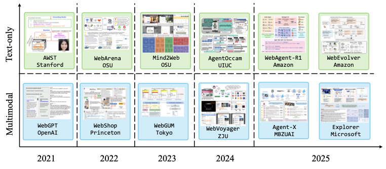

# Частина 9: Застосування Code LLM

Стрімка еволюція Code LLM спричинила парадигмальний зсув у розробці програмного забезпечення: перехід від дослідницьких прототипів до повноцінних інструментів, інтегрованих у весь життєвий цикл розробки (SDLC). Сучасні застосунки можна класифікувати за їхньою архітектурою та функціональними можливостями на кілька ключових доменів.

---

## 9.1 IDE-асистенти та хмарні платформи

Ця категорія фокусується на розумінні контексту репозиторію та наданні інтелектуальної допомоги безпосередньо в середовищі розробки.

### 9.1.1 Провідні асистенти
*   **GitHub Copilot:** Використовує мультимодельну підтримку (GPT-4o, Claude 3.5, Gemini 1.5). Режим *Copilot Workspace* дозволяє генерувати плани виконання завдань на рівні всього репозиторію.
*   **Cursor:** AI-native IDE, що використовує **дерева Меркла** для інкрементальної індексації коду та **Cascade architecture** для крос-файлового редагування в режимі Composer.
*   **Amazon Q Developer:** Спеціалізований на AWS, забезпечує автоматичну модернізацію коду (наприклад, Java upgrades) та безпеку корпоративного рівня.
*   **Gemini Code Assist:** Має найбільше контекстне вікно (до 2 млн токенів), що критично для аналізу великих монорепозиторіїв.

### 9.1.2 Термінальні та Cross-Environment агенти
*   **Aider:** Лідує серед open-source інструментів, використовуючи мапу репозиторію на основі tree-sitter для економії контексту.
*   **Claude Code (Anthropic) \u0026 Manus:** Впроваджують автономне виконання дій у терміналі та браузері, використовуючи Model Context Protocol (MCP) для розширюваної інтеграції інструментів.

---

## 9.2 Мультимодальна генерація коду (MCG)

MCG розширює можливості моделей від чисто текстового введення до розуміння зображень, ескізів та інтерактивних сигналів.

### 9.2.1 Генерація фронтенд-інтерфейсів
*   **Screenshot-to-Code:** Системи як **Design2Code** та **UICoder** використовують автоматичні петлі зворотного зв'язку (compile-render-CLIP) для ітеративного покращення якості коду.
*   **Sketch-to-Code:** Перетворює ручні начерки (wireframes) у функціональний код. Дослідження показують, що фахівці UI/UX надають перевагу інтерактивним режимам з можливістю уточнення.

### 9.2.2 Візуалізація даних (Chart-to-Code)
Фокусується на розумінні чартів для генерації коду (Python/Matplotlib), який їх відтворює.
*   **nvAgent:** Мультиагентна система з ролями аналітика та кодера, що забезпечує високу точність на бенчмарку nvBench.
*   **ChartMimic:** Складний бенчмарк для оцінки крос-модальних міркувань при реконструкції наукових графіків.

### 9.2.3 Артефакти програмної інженерії (UML, Flowcharts)
*   **DiagrammerGPT:** Генерує діаграми архітектури через цикл планування та рев'ю.
*   **Flow2Code:** Перетворює блок-схеми в логіку коду на 15+ мовах програмування.

**Таблиця 9.1: Репрезентативні бенчмарки мультимодальної генерації коду**

| Бенчмарк | Рік | Тип завдання | Ключова інновація |
| :--- | :--- | :--- | :--- |
| **Design2Code** | 2024 | Screenshot → HTML | TreeBLEU, DOM-ED метрики |
| **UICoder** | 2024 | UI → Code | Автоматична петля зворотного зв'язку |
| **nvBench 2.0** | 2025 | NL → Chart | Обробка неоднозначностей у запитах |
| **VisualWebArena** | 2024 | Visual Web Tasks | Навігація + Візуальне розуміння |
| **ArtifactsBench** | 2025 | Code → Artifacts | Програмний рендеринг для оцінки |
| **HumanEval-V** | 2024 | Visual Reasoning | Складні діаграми в задачах кодування |

---

## 9.3 Агенти комп'ютерного використання (GUI Agents)

Це новий клас агентів, що взаємодіють з операційною системою чи вебом через графічний інтерфейс.

*Рисунок 9.1: Еволюція GUI-агентів для взаємодії з веб-інтерфейсами (2021–2025).*

1.  **Сприйняття (Perception):** Використання VLMs (Vision-Language Models) для аналізу скріншотів та accessibility-дерев (HTML/a11y).
2.  **Взаємодія (Interaction):** Симуляція дій людини (Mouse/Keyboard) через бібліотеки типу `pyautogui` або прямий виклик API для вищої ефективності.

---

## 9.4 Спеціалізовані системи перевірки та виправлення

*Рисунок 9.2: Процес локалізації помилок у системах автоматичного виправлення (APR).*

*   **RepairAgent:** Впроваджує 5-етапний цикл: локалізація помилки → гіпотеза → патч → валідація → ітерація.
*   **AutoSpec:** Автоматично синтезує формальні специфікації для верифікації за допомогою надійних інструментів статичного аналізу.
*   **PR-Agent (Qodo-AI):** Автоматизує аналіз архітектури та виявлення ризиків безпеки в Pull Requests.

---

## 9.5 Виклики та майбутнє
1.  **Надійність планування:** Багатокрокове планування все ще залишається вразливим у реальних сценаріях.
2.  **Безпека даних:** Розвиток локальних моделей (on-premise) для захисту інтелектуальної власності.
3.  **Демократизація розробки:** Перехід до програмування природною мовою та візуальними образами.

---

**Наступний розділ:** [Частина 10: Висновки та майбутні перспективи](./Part_10_Conclusion.md)
